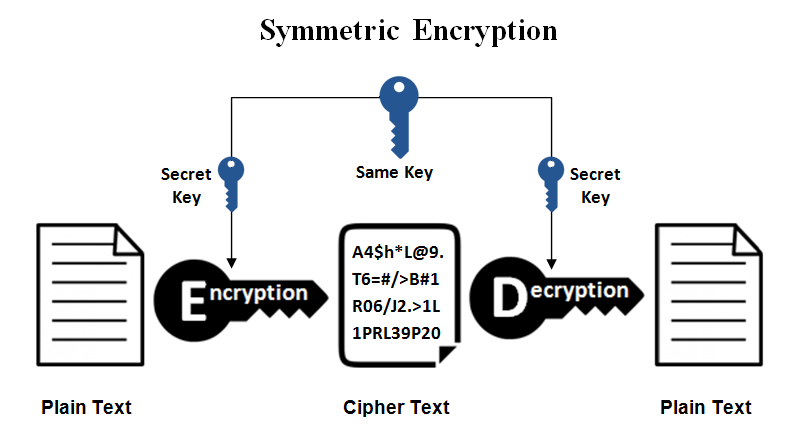
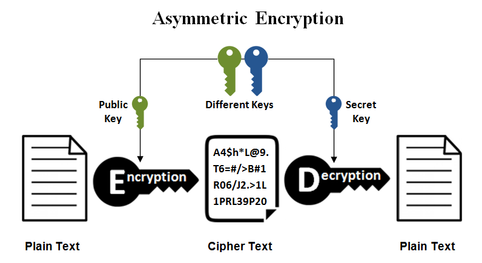
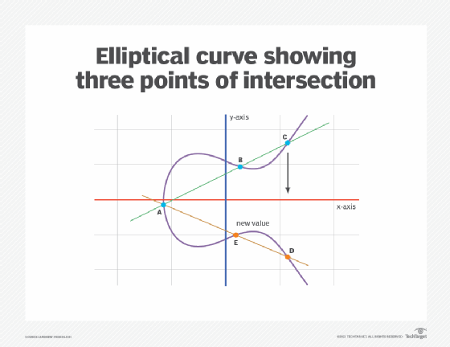

# Mathematical Foundation for Blockchain

### Q1. Describe Symmetric Key Encryption with neat diagram

- Cryptography in blockchain is the practice of securing information through encoding techniques to ensure data confidentiality, integrity, and authenticity.
- Only those who are authorized should be able to access and make use of the data, this is main goal of cryptography.
- Cryptography or Encryption is the process of converting plaintext into ciphertext, which is unreadable without the key.
- Symmetric Key Encryption is a type of encryption where the same key is used for both encryption and decryption of data.
- In the context of blockchain, symmetric key encryption ensures that data transmitted across the network is kept confidential and secure from unauthorized access.
- (Purposes) Although symmtric encryption is older type of encryption, it is still widely used in blockchain due to its efficiency and speed.
- Comparatively to asymmetric encryption, Asymmetric encryption places a burden network due to issues with data size and high CPU usage, Symmetric does not have such issues.

#### How Symmetric Key Encryption Works:
1. **Plaintext**: The original data that needs to be encrypted.
2. **Encryption**: The plaintext is encrypted using a symmetric key, transforming it into ciphertext, which is unreadable without the key.
3. **Ciphertext**: The encrypted data, which can be safely transmitted over the network.
4. **Decryption**: The recipient, who has the symmetric key, can decrypt the ciphertext back into plaintext.

#### Use in Blockchain:
- **Confidentiality**: Symmetric key encryption is used to protect sensitive information, such as private transactions or personal data, within a blockchain.
- **Efficiency**: Symmetric encryption is generally faster than asymmetric encryption, making it suitable for large data sets.
- **Key Management**: Since the same key is used for encryption and decryption, secure key management is critical to prevent unauthorized access.

### Diagram: Symmetric Key Encryption Process



1. **Two boxes**: One labeled "Sender" on the left and one labeled "Receiver" on the right.
2. **Plaintext (P)**: An arrow starts from the "Sender" with a label "Plaintext (P)".
3. **Encryption Process**: The arrow points to a "lock" icon with the label "Symmetric Key (K)" and continues to the right as "Ciphertext (C)".
4. **Ciphertext Transmission**: The arrow carrying "Ciphertext (C)" moves to the "Receiver".
5. **Decryption Process**: At the "Receiver", another "lock" icon labeled "Symmetric Key (K)" decrypts "Ciphertext (C)" back into "Plaintext (P)".
6. **Final Arrow**: The arrow ends at the "Receiver" box with "Plaintext (P)" indicating the data is restored.

---

### Q2. Describe Assymmetric Key Encryption with neat diagram

### Asymmetric Key Encryption in Blockchain Technology

- Cryptography in blockchain is the practice of securing information through encoding techniques to ensure data confidentiality, integrity, and authenticity.
- Only those who are authorized should be able to access and make use of the data, this is main goal of cryptography.
- Cryptography or Encryption is the process of converting plaintext into ciphertext, which is unreadable without the key.

- **Asymmetric Key Encryption** is a cryptographic method that uses a pair of keys: a **public key** and a **private key**. These keys are mathematically related but are different from each other.
- In this system, the public key is used to encrypt data, while the private key is used to decrypt it. This method is fundamental in blockchain technology, particularly for ensuring secure transactions and authentication.
- Comparatively to symmetric encryption, Asymmetric encryption is more secure and efficient for large data sets.
- (Advantage) In public-key cryptography, digital signatures are used so that the receiver of the message is able to identify whether or not the message was changed while it was in route. It is impossible to make changes to a message that has been digitally signed without making the signature invalid.


#### How Asymmetric Key Encryption Works:
1. **Key Pair Generation**: A user generates a pair of keys—one public and one private.
2. **Public Key (PU)**: This key is shared openly and can be distributed to anyone.
3. **Private Key (PR)**: This key is kept secret and is known only to the owner.
4. **Encryption**: Data (plaintext) is encrypted using the recipient's public key. This ensures that only the recipient, who possesses the corresponding private key, can decrypt the data.
5. **Decryption**: The recipient uses their private key to decrypt the ciphertext back into plaintext.

#### Use in Blockchain:
- **Confidentiality**: Only the intended recipient can decrypt messages encrypted with their public key.
- **Authentication**: The private key is used to sign transactions, and the public key can verify the authenticity, ensuring that the transaction was initiated by the rightful owner.
- **Non-repudiation**: Since only the private key owner can sign data, the sender cannot deny sending the message or transaction.

### Diagram: Asymmetric Key Encryption Process



1. **Two Boxes**: One labeled "Sender" on the left and one labeled "Receiver" on the right.
2. **Key Pair Generation**: An icon representing a key pair with labels "Public Key (PU)" and "Private Key (PR)" near the "Receiver".
3. **Public Key Sharing**: An arrow from the "Receiver" labeled "Public Key (PU)" going to the "Sender."
4. **Plaintext (P)**: A label showing the "Plaintext (P)" near the "Sender."
5. **Encryption Process**: An arrow from "Plaintext (P)" passes through a "lock" icon labeled "Encrypt with Public Key (PU)" and continues as "Ciphertext (C)" toward the "Receiver."
6. **Ciphertext Transmission**: The "Ciphertext (C)" reaches the "Receiver."
7. **Decryption Process**: The ciphertext goes through a "lock" icon labeled "Decrypt with Private Key (PR)" and converts back to "Plaintext (P)."
8. **Final Arrow**: The arrow ends at the "Receiver" box with "Plaintext (P)" indicating the data has been successfully decrypted.

This diagram visually represents the encryption and decryption process in asymmetric key encryption, emphasizing the use of different keys for encryption and decryption.

---

### Q3. Differentiate asymmetric and symmetric key cryptography.

### Differences Between Asymmetric and Symmetric Key Cryptography

| Feature                            | Symmetric Key Cryptography                         | Asymmetric Key Cryptography                        |
|------------------------------------|----------------------------------------------------|----------------------------------------------------|
| **Key Usage**                      | Uses a single key for both encryption and decryption. | Uses a pair of keys: one public key for encryption and one private key for decryption. |
| **Key Sharing**                    | The key must be shared secretly between the sender and receiver. | The public key is openly shared, while the private key is kept secret. |
| **Encryption Speed**               | Generally faster, making it suitable for encrypting large amounts of data. | Generally slower due to the complexity of the encryption process. |
| **Security**                       | Less secure if the key is compromised, as the same key is used for both processes. | More secure since the private key is never shared, and the public key cannot decrypt messages. |
| **Key Management**                 | Requires secure key distribution and management; the same key must be distributed to all parties involved. | Simplifies key management as only the public key needs to be distributed, while the private key remains secure. |
| **Scalability**                    | Less scalable due to the need for a unique key for each pair of users. | More scalable since one public key can be distributed to multiple users. |
| **Typical Use Cases**              | Used in situations where speed is critical, such as encrypting large files or in closed systems with fewer users. | Used for secure communication over the internet, digital signatures, and blockchain transactions. |
| **Example Algorithms**             | AES (Advanced Encryption Standard), DES (Data Encryption Standard). | RSA (Rivest–Shamir–Adleman), ECC (Elliptic Curve Cryptography). |
| **Resource Consumption**           | Consumes fewer computational resources, making it efficient for resource-constrained devices. | Consumes more computational resources, especially during key generation and encryption. |
| **Confidentiality and Integrity**  | Provides confidentiality but may require additional mechanisms for integrity. | Provides both confidentiality and integrity through digital signatures and public key infrastructure. |
| **Names**  | have diff names: secret - key cryptography, private - key cryptography | Public key cryptography. |

### Summary:
- **Symmetric Key Cryptography** is faster and more efficient for encrypting large data sets but requires secure key distribution.
- **Asymmetric Key Cryptography** offers enhanced security through separate public and private keys, making it ideal for secure communication and digital signatures, though it is slower and more resource-intensive.


---

### Q4. Illustrate Elliptic Curve Gyptography.

- Elliptic Curve Cryptography (ECC) is an advanced form of public-key cryptography based on the algebraic structure of elliptic curves over finite fields.
- ECC provides the same level of security as other public-key systems (like RSA) but with smaller key sizes, making it efficient in terms of computational power and bandwidth.
- ECC is used in blockchain systems, digital signatures, and other applications.
- The term “elliptic curve” is derived from the ellipse.


### Basic Concepts:
1. **Elliptic Curve**: An elliptic curve is a set of points that satisfy a specific mathematical equation. In the context of ECC, the equation typically has the form:
   
   \[
   y^2 = x^3 + ax + b
   \]

   Here, \(a\) and \(b\) are constants that define the specific curve. The curve is defined over a finite field, meaning that the values of \(x\) and \(y\) are limited to a certain range of integers.

2. **Points on the Curve**: Each point \((x, y)\) on the curve is a solution to the equation. There is also a special point called the "point at infinity," which acts as the identity element in the elliptic curve group.

3. **Public and Private Keys**: In ECC, a private key is a randomly selected integer, and the corresponding public key is a point on the elliptic curve obtained by multiplying a base point (a predefined point on the curve) by the private key.

   - **Private Key**: A randomly chosen integer (d).
   - **Public Key**: A point (P = d . G), where (G) is the base point on the curve.

4. **Elliptic Curve Discrete Logarithm Problem (ECDLP)**: The security of ECC is based on the difficulty of solving the ECDLP, which is finding the integer \(d\) given \(P\) and \(G\).



### Q5. List and explain advantages of ECC

Elliptic Curve Cryptography (ECC) offers several advantages over other cryptographic systems, particularly those based on RSA and DSA (Digital Signature Algorithm). Here are the key benefits:

### 1. **Smaller Key Sizes**:
   - **Efficiency**: ECC provides the same level of security as RSA or DSA but with much smaller key sizes. For example, a 256-bit key in ECC provides comparable security to a 3072-bit RSA key.
   - **Lower Computational Requirements**: Smaller key sizes mean that ECC requires less computational power, making it faster and more efficient, particularly on devices with limited resources such as smartphones, IoT devices, and embedded systems.

### 2. **Faster Computations**:
   - **Speed**: Due to the smaller key sizes and simpler arithmetic operations on elliptic curves, ECC can perform encryption, decryption, and key generation operations more quickly than RSA or DSA. This results in faster SSL/TLS connections and quicker transaction processing in blockchain applications.

### 3. **Lower Bandwidth Usage**:
   - **Compact Signatures**: ECC generates smaller digital signatures, leading to reduced bandwidth usage. This is particularly beneficial in environments with limited bandwidth or where large volumes of transactions or messages are transmitted, such as in blockchain networks or mobile communications.

### 4. **Increased Security**:
   - **Stronger Security per Bit**: ECC provides higher security per bit of key length, making it more resilient against attacks such as brute force or quantum computing. As cryptographic systems face increasing threats from advances in computing power, ECC's strong security is a significant advantage.

### 5. **Scalability**:
   - **Adaptability to Various Applications**: ECC is highly scalable and can be implemented in various cryptographic protocols and applications, including digital signatures, key exchange, and encryption. Its efficiency and security make it suitable for both high-performance and resource-constrained environments.

### 6. **Energy Efficiency**:
   - **Lower Power Consumption**: The reduced computational requirements of ECC translate to lower energy consumption. This is crucial for battery-powered devices, making ECC ideal for mobile devices, IoT sensors, and other energy-sensitive applications.

### 7. **Better Suitability for Blockchain**:
   - **Optimized for Blockchain**: ECC is widely used in blockchain technology due to its efficiency and security. For example, Bitcoin and Ethereum use ECC for creating and managing digital wallets, signing transactions, and ensuring the integrity of the blockchain.

### Summary:
ECC is favored for its balance of security, efficiency, and practicality, making it a strong choice for modern cryptographic needs, especially in contexts where computational resources and bandwidth are limited, or where high security is paramount, such as in blockchain technology, mobile communications, and secure web connections.


---


### Q6. Justify the importance of Hashing in Block Chain
## The Importance of Hashing in Blockchain OR Discuss role of hashing in blockchain

Hashing is a fundamental component of blockchain technology, providing several critical functions that ensure its security, integrity, and efficiency. Here are some key reasons why hashing is essential in blockchain:

### 1. **Data Integrity and Tamper-Proofness:**
* **Unique Hash:** Each block in a blockchain contains a unique hash value. This hash is generated based on the data within the block, including the previous block's hash.
* **Tamper Detection:** If any data within a block is altered, the hash value will change. This makes it immediately apparent that the block has been tampered with, ensuring the integrity of the blockchain.

### 2. **Chain Formation and Linking:**
* **Previous Block Hash:** Each block stores the hash of the previous block. This creates a chain of blocks, linking them together chronologically.
* **Immutability:** Once a block is added to the chain, it becomes virtually impossible to alter without affecting subsequent blocks. This ensures the immutability of the blockchain.

### 3. **Mining Mechanism:**
* **Proof of Work (PoW):** In many blockchain networks, miners compete to find a hash value that meets specific criteria. This process, known as mining, is essential for achieving consensus on the validity of transactions and blocks.
* **Security:** The computational effort required to find a valid hash makes it difficult for malicious actors to manipulate the network.

### 4. **Transaction Verification:**
* **Merkle Trees:** Hashing is used to create Merkle trees, which are efficient data structures that can verify the validity of a large number of transactions within a block.
* **Efficiency:** Merkle trees allow for efficient verification, reducing the computational overhead for nodes on the network.

### 5. **Security and Trust:**
* **Decentralization:** The use of hashing ensures that the blockchain is decentralized, as no single entity controls the network.
* **Trust:** By providing a secure and transparent way to store and verify data, hashing fosters trust among participants in the blockchain network.

In summary, hashing plays a crucial role in blockchain by ensuring data integrity, linking blocks together, facilitating consensus mechanisms, verifying transactions, and providing a secure and decentralized environment. Without hashing, blockchain would not be able to function as a reliable and secure distributed ledger.


---

### Q7. Discuss the properties of hash function.

## Properties of Hash Functions

Hash functions are essential tools in computer science, used to map large data sets into smaller fixed-size outputs. They have several key properties that make them valuable for various applications:

### 1. **Determinism:**
* **Consistent output:** A hash function always produces the same output for a given input. This ensures that the hash value is unique and reproducible.

### 2. **Efficiency:**
* **Rapid computation:** Hash functions are designed to be computationally efficient, allowing for quick calculations even on large datasets. This is crucial for real-time applications.

### 3. **Uniformity:**
* **Even distribution:** A good hash function should distribute the output values uniformly across the possible range. This helps to avoid collisions and ensures that the hash table is evenly filled.

### 4. **Sensitivity:**
* **Small changes, big impact:** A hash function should be sensitive to small changes in the input data. This property is essential for detecting data integrity and preventing unauthorized modifications.

### 5. **Collisions:**
* **Minimized but unavoidable:** While it's impossible to completely eliminate collisions in hash functions, they should be minimized. Techniques like chaining or open addressing can be used to handle collisions gracefully.

### 6. **Non-invertibility:**
* **One-way function:** Given a hash value, it should be computationally infeasible to determine the original input data. This property is crucial for security applications like password hashing.

### 7. **Avalanche Effect:**
* **Small changes, big impact:** A small change in the input data should result in a significant change in the hash value. This helps to prevent attackers from reverse-engineering the hash function.

### 8. **Cryptographic Hash Functions:**
* **Additional security:** For security-sensitive applications, cryptographic hash functions are used. They offer stronger properties like collision resistance and preimage resistance.

**Common Applications of Hash Functions:**
* **Data structures:** Hash tables
* **Cryptography:** Password hashing, digital signatures, blockchain technology
* **Data integrity:** Checksums, message authentication codes (MACs)
* **Indexing:** Database indexing
* **Search:** Efficient searching algorithms

By understanding these properties, you can select the appropriate hash function for your specific needs and ensure its effectiveness in your applications.


---

### Q8. Explain working of SHA 256 Algorithm.

## SHA-256 Algorithm: A Breakdown
- SHA family includes several algorithms,such as SHA-0,SHA-1,SHA-3, SHA-4 each with different output sizes. SHA-256 is one of the most popular and widely used algorithms in this family.
- **SHA-256** (Secure Hash Algorithm 256) is a cryptographic hash function that produces a 256-bit (32-byte) hash value.
- It's widely used for various security applications, including digital signatures, password hashing, and blockchain technology.

### The Process

1. **Message Padding:**
   * **Length Calculation:** The length of the message (in bits) is appended to the end of the message.
   * **Padding:** The message is padded with zeros to make its length a multiple of 512 bits. This is done by adding a single '1' bit followed by a series of '0' bits.

2. **Message Block Processing:**
   * **Divide into Blocks:** The padded message is divided into 512-bit blocks.
   * **Initialize Hash Values:** A set of eight 32-bit initial hash values are used. These values are predefined constants.
   * **Iterative Process:** For each block:
     * **Create a Working Variable:** A working variable (a 32-bit word) is created.
     * **Round Functions:** A series of 64 rounds are performed. Each round involves:
       * **Message Schedule:** The current block is processed to create a message schedule, a series of 64 32-bit words.
       * **Arithmetic Operations:** The working variable is updated using a combination of arithmetic operations (addition, AND, OR, XOR, NOT) and bitwise shifts.
       * **Constants:** Predefined constants are used in the calculations.

3. **Final Hash Calculation:**
   * **Combine Hash Values:** The final hash value is calculated by combining the updated hash values from the last block.

### Key Points

* **Security:** SHA-256 is considered to be a secure hash function and has not been successfully attacked.
* **Efficiency:** It is relatively efficient, making it suitable for various applications.
* **Widely Used:** SHA-256 is used in many standards and protocols, including Bitcoin and other cryptocurrencies.
* **Variants:** There are other variants of SHA-2, such as SHA-512, SHA-384, and SHA-224, with different output sizes.

**In essence, SHA-256 takes an input message, processes it through a series of rounds involving arithmetic operations and bitwise manipulations, and produces a fixed-size hash value.** This hash value is unique to the input message and can be used to verify data integrity and authenticity.

---

### Q9. Describe Digital Signature & Verification steps in Digital Signature Algorithm.

The **Digital Signature Algorithm (DSA)** is a widely used cryptographic algorithm for ensuring the authenticity and integrity of a message or document. It provides a mechanism for generating a digital signature, which can be verified by the recipient to confirm that the message was sent by the claimed sender and that it hasn't been altered. 

Here’s how the Digital Signature and Verification process works:

### **1. Digital Signature Generation:**
The goal of this step is for the sender to generate a digital signature based on the message being sent. The process involves the use of the sender’s private key and a hash function.

#### Steps:
1. **Message Hashing:**
   - The sender applies a hash function (like SHA-256) to the message or document to create a fixed-size digest (hash value) of the message.
   - This digest is much smaller than the original message and uniquely represents the message content.
   - Example: Message → Hash Function → Hash (Message Digest)

2. **Signature Generation:**
   - The sender uses their **private key** to encrypt the hash of the message. This encryption creates the digital signature.
   - In DSA, instead of encrypting the hash directly, a pair of integers (r, s) is generated as the signature using a combination of the message hash, the private key, and some algorithm-specific parameters (including a random number `k`).
   - The resulting digital signature (r, s) is unique to both the message and the sender's private key.

3. **Send the Message and Signature:**
   - The sender transmits the original message along with the digital signature (r, s) to the recipient.

### **2. Digital Signature Verification:**
This step is performed by the recipient to verify the authenticity of the signature and ensure that the message was not tampered with.

#### Steps:
1. **Hash the Received Message:**
   - The recipient applies the same hash function used by the sender to the received message, generating a hash value (message digest) of the message.
   - This should match the hash value used in the signature generation if the message has not been altered.
   
2. **Signature Verification:**
   - The recipient uses the sender’s **public key** to verify the signature. The public key corresponds to the sender's private key but does not reveal it.
   - DSA performs a set of calculations using the public key, the signature `(r, s)`, and the message hash. The goal is to confirm that the signature was generated by the private key corresponding to the public key.
   - In this step, the recipient performs mathematical checks that involve recomputing a value based on the signature, the public key, and the message digest. If the recomputed value matches `r`, the signature is valid.

3. **Verification Result:**
   - If the calculated values match, the signature is confirmed as valid. This indicates that:
     - The message was indeed signed by the person who holds the private key.
     - The message has not been altered during transmission.
   - If the values do not match, the signature is considered invalid, implying either the message was altered or the signature was not generated by the sender.


### **Applications of Digital Signatures:**
- **Authenticity and Integrity:** Digital signatures verify that a message comes from a particular sender and has not been modified.
- **Non-repudiation:** The sender cannot deny having signed the message because the signature is unique to the private key and the message.

### **Conclusion:**
The Digital Signature Algorithm provides a secure method for creating digital signatures using cryptographic keys and hash functions. The signature generation process involves signing the hash of a message with a private key, while the verification process checks the validity of the signature using the corresponding public key.


---

### Q10. What is Merkle tree? Explain the structure of merkle tree.

A **Merkle tree**, also known as a **hash tree**, is a data structure used in computer science and cryptography to verify the integrity and consistency of data. It is widely used in distributed systems like blockchains, peer-to-peer networks, and version control systems. Merkle trees allow efficient and secure verification of the content in large data structures, making them ideal for scenarios where data integrity must be maintained.

### **What is a Merkle Tree?**

A Merkle tree is a binary tree (though it can also be generalized to other arities) where:
- **Each leaf node** contains the hash of a data block.
- **Each non-leaf (interior) node** contains the hash of the concatenation of its two child nodes' hashes.

The **root of the tree** (Merkle root) is a single hash that summarizes all the data in the tree. If any data in any leaf node is modified, the change will propagate up through the tree, resulting in a different root hash. Thus, the Merkle root provides a compact and secure representation of the integrity of the entire dataset.

### **Structure of a Merkle Tree:**

1. **Leaf Nodes:**
   - The leaf nodes represent individual pieces of data (e.g., transactions in a blockchain).
   - Each leaf node stores the hash of the corresponding data block.

2. **Non-leaf Nodes:**
   - The non-leaf nodes represent the hash of their child nodes.
   - These nodes are generated by concatenating the hashes of their two child nodes and then hashing the result.
   - This process continues recursively until only one hash remains at the top, known as the **Merkle root**.

3. **Merkle Root:**
   - The Merkle root is the topmost node in the tree and represents the final hash value that summarizes all the data blocks.
   - If any data in the leaf nodes changes, the root hash will change, allowing the detection of any alterations or corruptions.

### **Illustration of Merkle Tree Structure:**

Here is how the structure of a Merkle tree would look:

```
        Merkle Root
           /    \
      H(AB)    H(CD)
      /  \       /  \
   H(A) H(B)  H(C) H(D)
    |    |     |    |
   A     B     C    D
```

### Benefits of Merkel tree:

A Merkle tree, or hash tree, is a data structure used in blockchain for efficient and secure data verification. Here are its key benefits:

1. **Efficient Verification**: Allows quick verification of data integrity using only a few hashes, making it faster and more efficient.

2. **Data Security**: Detects tampering by propagating any changes in data through the tree, altering the root hash and ensuring data integrity.

3. **Reduced Data Transfer**: Supports partial data transfer, saving bandwidth by only transmitting necessary portions of the data for verification.

4. **Lightweight Clients**: Enables lightweight clients (like mobile wallets) to verify transactions without downloading the entire blockchain.

5. **Scalable and Organized**: Aggregates data efficiently and organizes it hierarchically, supporting scalable and secure data management in distributed systems.


### **Applications of Merkle Trees:**

1. **Blockchain:**
   - In blockchain systems like Bitcoin and Ethereum, Merkle trees are used to efficiently and securely verify transactions. The Merkle root is included in the block header, and anyone can verify that a specific transaction belongs to a block by using a Merkle proof.

2. **Distributed Systems:**
   - Merkle trees are used in distributed systems to verify the consistency of data replicated across multiple nodes. If two nodes have the same Merkle root, their datasets are identical.

3. **Version Control Systems:**
   - In systems like Git, Merkle trees are used to represent the contents of files and directories, enabling quick detection of changes and efficient synchronization.

4. **Data Synchronization:**
   - In scenarios like database synchronization, Merkle trees allow systems to quickly identify differences between datasets, reducing the amount of data that needs to be transferred.

### **Conclusion:**

A Merkle tree is a powerful data structure that allows efficient and secure verification of large data sets. Its tree-like structure, based on hash values, ensures that even a small change in the data will propagate and affect the entire tree, making it easy to detect and prevent tampering. This makes Merkle trees indispensable for applications in blockchain, distributed systems, and version control systems.