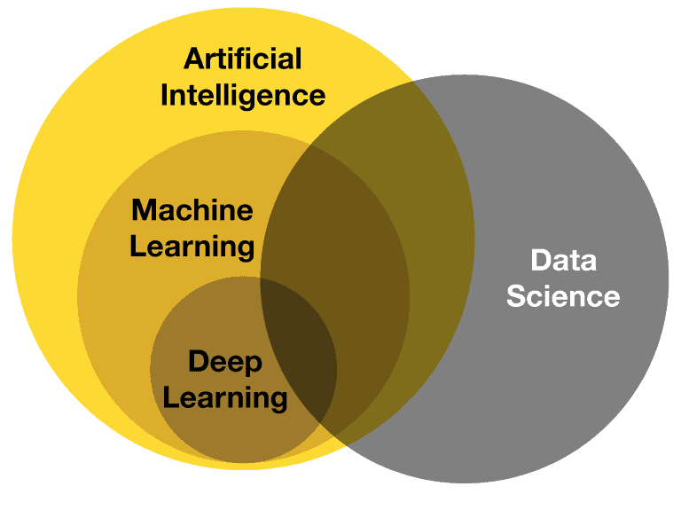

# Introduction To Machine Learning

### Q1. What is Machine Learning? Explain applications of Machine Learning in data science.

- Machine Learning (ML) is a subset of artificial intelligence (AI) that enables systems to learn from data and improve their performance on a specific task without being explicitly programmed.
- Instead of being hand-coded with rules, ML algorithms learn patterns and relationships within data, allowing them to make predictions or decisions.

### How Machine Learning Works:
1. **Data Collection:** The fuel for ML algorithms ML begins with gathering data relevant to the problem at hand.
2. **Data Preprocessing:** The raw data is cleaned, formatted, and transformed into a suitable format for analysis.
3. **Model Training:** An ML model is created using the data, where the model learns the relationships between the input and output data.
4. **Model Evaluation:** The model is tested on unseen data to evaluate its performance and accuracy.
5. **Prediction/Inference:** Once validated, the model can make predictions or provide insights on new data.
6. **Optimization:** The model is fine-tuned for better performance.

### Applications of Machine Learning in Data Science

Machine learning is a cornerstone of data science, enabling a wide range of applications across various industries. Here are some prominent examples:

1. **Predictive Analytics:**
   * **Customer churn prediction:** Identifying customers likely to discontinue their service.
   * **Fraud detection:** Detecting fraudulent transactions in financial institutions.
   * **Demand forecasting:** Predicting future demand for products or services.

2. **Recommendation Systems:**
   * **Product recommendations:** Suggesting relevant products to customers based on their purchase history or preferences.
   * **Movie or song recommendations:** Providing personalized recommendations based on user ratings or listening habits.

3. **Natural Language Processing (NLP):**
   * **Sentiment analysis:** Determining the sentiment (positive, negative, neutral) of text data.
   * **Machine translation:** Translating text from one language to another.
   * **Chatbots and virtual assistants:** Creating conversational agents that can interact with users.

4. **Image and Video Analysis:**
   * **Object recognition:** Identifying objects within images or videos.
   * **Image classification:** Categorizing images into different classes (e.g., cats, dogs, cars).
   * **Facial recognition:** Recognizing individuals based on their facial features.

5. **Healthcare:**
   * **Disease diagnosis:** Assisting in diagnosing diseases based on medical images or patient data.
   * **Drug discovery:** Accelerating the process of discovering new drugs.
   * **Personalized medicine:** Tailoring treatments to individual patients based on their genetic makeup and medical history.

6. **Financial Services:**
   * **Risk assessment:** Evaluating the creditworthiness of individuals or businesses.
   * **Algorithmic trading:** Making automated trading decisions based on market data.

7. **Marketing:**
   * **Customer segmentation:** Grouping customers based on their characteristics and behaviors.
   * **Targeted advertising:** Delivering ads to the most relevant audience.

These are just a few examples of how machine learning is transforming data science. As technology continues to advance, we can expect even more innovative applications to emerge in the future.
---

### Q2. Why machine learning important?

**Machine Learning (ML) is important for several reasons:**

1. **Automation:** ML can automate repetitive tasks, freeing up human resources for more complex and strategic work.
2. **Efficiency:** ML algorithms can process large datasets quickly and accurately, leading to improved efficiency and decision-making.
3. **Personalization:** ML enables personalized experiences, such as product recommendations and targeted marketing.
4. **Innovation:** ML is driving innovation in various industries, from healthcare to finance, by developing new products and services.
5. **Problem-solving:** ML can help solve complex problems that are difficult or impossible for humans to tackle alone.
6. **Competitive advantage:** Companies that leverage ML can gain a significant competitive advantage over those that do not.

In essence, ML is transforming the way we live and work by enabling us to extract valuable insights from data, automate processes, and make better decisions.

---

### Q3. Compare machine learning with traditional programming 

Machine Learning (ML) and Traditional Programming represent two distinct approaches to problem-solving and software development. Here’s a comparison of the two:

### 1. **Approach to Problem-Solving:**

- **Traditional Programming:**
  - **Rule-Based:** In traditional programming, a developer explicitly writes the rules and logic for the program to follow. The programmer defines how the input data should be processed to generate the desired output.
  
- **Machine Learning:**
  - **Data-Driven:** In ML, instead of explicitly coding rules, a model is trained using data. The model learns patterns and relationships from the data to make predictions or decisions.

### 2. **Development Process:**

- **Traditional Programming:**
  - **Programming Logic:** The developer writes the code, defines the logic, and tests the program to ensure it meets the specifications.

- **Machine Learning:**
  - **Model Training:** The focus is on selecting and training an appropriate model with a dataset. The model learns by adjusting its parameters based on the data.

### 3. **Handling of Data:**

- **Traditional Programming:**
  - **Specific Data Requirements:** Programs are often designed to handle specific types of data in a structured format, such as numbers or text strings, with predefined data structures.
  - **Limited Flexibility:** Handling unstructured or unexpected data usually requires additional coding and logic.

- **Machine Learning:**
  - **Versatile Data Handling:** ML can handle large volumes of both structured and unstructured data (e.g., images, text, audio).
  - **Data Dependency:** The performance of an ML model heavily depends on the quality and quantity of the data provided during training.

### 4. **Adaptability:**

- **Traditional Programming:**
  - **Static Behavior:** Once a program is written and deployed, it typically does not change unless the code is manually updated by the developer.
  - **Limited Adaptation:** To adapt to new requirements or data, the program needs to be rewritten or modified.

- **Machine Learning:**
  - **Dynamic Learning:** ML models can adapt to new data over time. For instance, retraining a model with new data can improve its performance.
  - **Self-Improvement:** Some ML models can continue to learn and improve as they are exposed to more data.

### 5. **Applications:**

- **Traditional Programming:**
  - **Clear Logic Problems:** Best suited for problems where the rules are well-understood and can be explicitly programmed, such as calculating taxes, managing databases, or automating repetitive tasks.
  
- **Machine Learning:**
  - **Complex Pattern Recognition:** Ideal for problems where the relationships in the data are complex or not easily defined, such as image recognition, natural language processing, and recommendation systems.

### 6. **Examples:**

- **Traditional Programming:**
  - **Example:** A program to calculate the total price of items in a shopping cart by applying predefined rules like discounts and tax calculations.
  
- **Machine Learning:**
  - **Example:** A model that predicts customer churn by analyzing patterns in customer behavior, purchase history, and interactions with customer support.

## Comparison of Traditional Programming and Machine Learning

| Feature | Traditional Programming | Machine Learning |
|---|---|---|
| **Approach** | Rule-based | Data-driven |
| **Problem-solving** | Explicit instructions | Pattern recognition |
| **Adaptability** | Limited | High |
| **Human involvement** | High | Lower |

### Q4. Discuss types of Machine Learning with suitable examples.

Machine Learning (ML) can be broadly categorized into different types based on how models learn from data. Each type of ML is suited for different tasks and has unique applications. Here’s a breakdown of the main types of Machine Learning with examples:

### **1. Supervised Learning**

**Definition:**  
In supervised learning, the model is trained on a labeled dataset, where each input data point is associated with a corresponding output label. The model learns to map inputs to outputs and can make predictions on new, unseen data.

**Examples:**
- **Email Spam Detection:** A model is trained on a dataset of emails labeled as "spam" or "not spam." It learns to identify characteristics of spam emails and can predict whether new emails are spam.
- **Medical Diagnosis:** A model trained on patient data (symptoms, medical history) and diagnoses can predict the likelihood of a disease in new patients.

### **2. Unsupervised Learning**

**Definition:**  
Unsupervised learning involves training a model on a dataset without labeled outputs. The model tries to find hidden patterns or intrinsic structures within the data.

**Examples:**
- **Market Basket Analysis:** Identifying sets of products frequently bought together in a supermarket, enabling product placement strategies.

### **3. Semi-Supervised Learning**

**Definition:**  
Semi-supervised learning uses a small amount of labeled data combined with a large amount of unlabeled data. The labeled data guides the model, while the unlabeled data helps improve learning accuracy.

**Examples:**
- **Web Page Classification:** A small number of web pages are labeled (e.g., "news," "blog," "e-commerce"), and the model uses these labels to classify a larger number of unlabeled pages.
- **Image Classification:** Using a few labeled images (e.g., "cat," "dog") and a large set of unlabeled images, the model improves its classification accuracy by learning from both.

### **4. Reinforcement Learning**

**Definition:**  
Reinforcement learning involves training a model by interacting with an environment. The model takes actions and receives feedback in the form of rewards or penalties. The goal is to learn a strategy that maximizes cumulative rewards over time.

**Examples:**
- **Game Playing:** Models like AlphaGo learn to play games like Go or chess by playing many games and optimizing strategies to win.
- **Robotics:** A robot can learn to navigate through a maze by trial and error, receiving rewards for reaching the goal and penalties for hitting obstacles.
- **Autonomous Vehicles:** Reinforcement learning is used to train self-driving cars to make decisions (e.g., when to turn, stop) based on continuous feedback from the environment.

### **5. Self-Supervised Learning**

**Definition:**  
Self-supervised learning is a subset of unsupervised learning where the model generates labels from the input data itself. The model creates tasks where the target outputs are derived from the input data, and it learns to solve these tasks.

**Examples:**
- **Natural Language Processing (NLP):** Models like BERT are trained using self-supervised learning, where they predict masked words in a sentence based on the context provided by the surrounding words.
- **Image Colorization:** A model is trained to predict the color version of a black-and-white image by learning from a dataset of color images.

### **6. Transfer Learning**

**Definition:**  
Transfer learning involves taking a pre-trained model (trained on one task) and applying it to a different but related task. This approach is especially useful when there is limited data available for the new task.

**Examples:**
- **Image Classification:** A model pre-trained on a large dataset like ImageNet can be fine-tuned to classify specific medical images (e.g., detecting tumors in MRI scans).
- **Language Translation:** A model trained on a large corpus of English text can be fine-tuned to translate between different languages.

**Common Approaches:**
- Fine-Tuning Pre-trained Models
- Feature Extraction

----

### Q5. Compare machine learning vs Artificial Intelligence Vs Data science

Machine Learning (ML), Artificial Intelligence (AI), and Data Science are closely related fields, often overlapping but distinct in their focus, methodologies, and applications. Here’s a comparison of the three:

### **1. Definition and Focus**

- **Artificial Intelligence (AI):**
  - **Definition:** AI is a broad field that focuses on creating systems capable of performing tasks that typically require human intelligence. These tasks include reasoning, problem-solving, perception, language understanding, and decision-making.
  - **Focus:** The ultimate goal of AI is to create systems that can perform complex tasks autonomously, emulating human intelligence.

- **Machine Learning (ML):**
  - **Definition:** ML is a subset of AI that focuses on the development of algorithms that enable computers to learn from data and improve their performance over time without being explicitly programmed for specific tasks.
  - **Focus:** The primary focus of ML is on learning patterns from data and making predictions or decisions based on that learning.

- **Data Science:**
  - **Definition:** Data Science is an interdisciplinary field that uses scientific methods, processes, algorithms, and systems to extract insights and knowledge from structured and unstructured data.
  - **Focus:** Data Science is centered on data exploration, analysis, and visualization to uncover actionable insights, often using tools and techniques from statistics, machine learning, and computer science.

### **2. Key Components**

- **Artificial Intelligence (AI):**
  - **Key Components:** AI encompasses a wide range of technologies, including ML, natural language processing (NLP), robotics, computer vision, expert systems, and more.
  - **Examples:** Voice assistants like Siri, self-driving cars, and AI-powered game agents like AlphaGo.

- **Machine Learning (ML):**
  - **Key Components:** ML includes algorithms and models such as supervised learning, unsupervised learning, reinforcement learning, and neural networks.
  - **Examples:** Email spam filters, recommendation systems (e.g., Netflix or Amazon), and fraud detection systems.

- **Data Science:**
  - **Key Components:** Data science involves data collection, cleaning, preprocessing, exploratory data analysis (EDA), statistical modeling, machine learning, and data visualization.
  - **Examples:** Analyzing customer data to identify trends, predicting stock prices using historical data, and creating dashboards for business decision-making.

### **3. Methods and Techniques**

- **Artificial Intelligence (AI):**
  - **Methods:** AI employs various techniques such as rule-based systems, heuristics, logic programming, search algorithms, and neural networks.
  - **Approach:** AI systems can be either rule-based or learning-based, depending on whether they rely on predefined rules or on learning from data.

- **Machine Learning (ML):**
  - **Methods:** ML uses statistical techniques and algorithms such as linear regression, decision trees, support vector machines (SVM), clustering, and deep learning.
  - **Approach:** ML models are trained on data to recognize patterns and make predictions or decisions. They can be supervised, unsupervised, semi-supervised, or reinforcement-based.

- **Data Science:**
  - **Methods:** Data science incorporates a variety of techniques from statistics, data mining, machine learning, and big data technologies. Tools like Python, R, SQL, Hadoop, and TensorFlow are commonly used.
  - **Approach:** The approach is data-centric, involving the entire data lifecycle from collection to interpretation, often incorporating machine learning models to enhance analysis.

### **4. Applications**

- **Artificial Intelligence (AI):**
  - **Applications:** AI is used in robotics, autonomous vehicles, natural language processing (e.g., chatbots, translation services), healthcare (e.g., diagnostic tools), and gaming.
  - **Example:** Self-driving cars use AI for real-time decision-making, navigating complex environments without human intervention.

- **Machine Learning (ML):**
  - **Applications:** ML is widely used in recommendation engines, image and speech recognition, predictive analytics, and personalized marketing.
  - **Example:** Netflix uses ML to recommend shows and movies to users based on their viewing history.

- **Data Science:**
  - **Applications:** Data science is applied in business intelligence, risk management, financial analysis, customer segmentation, and product development.
  - **Example:** A retail company might use data science to analyze customer purchase history and develop targeted marketing campaigns.

### **5. Relationship to Each Other**

- **Artificial Intelligence (AI):**
  - AI is the overarching field that encompasses various subfields, including machine learning, robotics, and NLP. Machine learning is a key component of AI but not the only one.

- **Machine Learning (ML):**
  - ML is a subset of AI focused on enabling systems to learn from data. It is one of the primary methods used to achieve AI, but AI can also involve other approaches, such as rule-based systems.

- **Data Science:**
  - Data Science overlaps with both AI and ML. While data science involves analyzing and interpreting data, it often leverages ML algorithms to build predictive models. However, data science also includes aspects like data engineering and statistical analysis, which are not specific to AI.

### **6. Skill Sets**

- **Artificial Intelligence (AI):**
  - **Skills:** Knowledge of algorithms, logic, search techniques, robotics, and neural networks. Proficiency in programming languages like Python, C++, and familiarity with AI frameworks like TensorFlow or PyTorch.

- **Machine Learning (ML):**
  - **Skills:** Strong foundation in mathematics (linear algebra, probability, statistics), understanding of ML algorithms, and experience with programming languages like Python, R, and libraries like scikit-learn, TensorFlow, and Keras.

- **Data Science:**
  - **Skills:** Proficiency in data manipulation and analysis, statistical modeling, machine learning, data visualization, and tools like Python, R, SQL, and big data technologies like Hadoop and Spark.

### **Summary:**

- **Artificial Intelligence (AI)** is the broadest field, aiming to create systems that can perform tasks requiring human intelligence. It encompasses various technologies, including machine learning.
- **Machine Learning (ML)** is a subset of AI that focuses on creating algorithms that can learn from data and make predictions or decisions without explicit programming.
- **Data Science** is an interdisciplinary field focused on extracting insights and knowledge from data, often utilizing machine learning techniques as part of its analysis but also involving data collection, cleaning, and visualization.

## Comparison of AI, ML, and DS

| Feature | Artificial Intelligence (AI) | Machine Learning (ML) | Data Science (DS) |
|---|---|---|---|
| **Definition** | Broad field of computer science focused on creating intelligent agents that can reason, learn, and act autonomously. | Subfield of AI that focuses on algorithms that allow computers to learn from data without being explicitly programmed. | Interdisciplinary field that uses scientific methods, processes, algorithms, and systems to extract knowledge and insights from data. |
| **Scope** | Encompasses a wide range of techniques, including natural language processing, computer vision, robotics, and expert systems. | Primarily concerned with developing algorithms that can learn from data and make predictions or decisions. | Involves a broader range of tasks, including data collection, cleaning, exploration, analysis, and visualization. |
| **Relationship** | ML is a subset of AI. DS is often used to prepare data for ML algorithms. | ML is a subset of AI. | DS is a broader field that encompasses ML and other techniques. |
| **Goal** | To create intelligent systems that can perform tasks that would require human intelligence. | To develop algorithms that can learn from data and improve their performance over time. | To extract insights and knowledge from data to inform decision-making. |
| **Techniques** | Neural networks, deep learning, genetic algorithms, expert systems, search algorithms. | Supervised learning, unsupervised learning, reinforcement learning, deep learning. | Data cleaning, data exploration, statistical analysis, data visualization, machine learning, predictive modeling. |
| **Applications** | Autonomous vehicles, virtual assistants, medical diagnosis, fraud detection, recommendation systems. | Image recognition, natural language processing, speech recognition, predictive analytics, anomaly detection. | Business intelligence, market research, healthcare analytics, scientific research, social science research. |

---

### Q6. Describe parametric and Non-parametric machine learning models.

In machine learning, models can be broadly categorized into **parametric** and **non-parametric** models based on how they learn from data and how they generalize to new data. Here’s a detailed explanation of both types:

### **1. Parametric Machine Learning Models**

**Definition:**  
Parametric models are those that have a fixed number of parameters that are determined during the training process. Once the model is trained, the number of parameters remains constant, regardless of the amount of training data. These models make strong assumptions about the data's underlying structure.

**Key Characteristics:**
- **Fixed Number of Parameters:** The model's complexity is determined by a fixed set of parameters. For example, a linear regression model with two features will always have two coefficients and one intercept, regardless of the size of the dataset.
- **Assumptions About Data:** Parametric models often make strong assumptions about the distribution of the data (e.g., assuming linearity in linear regression).
- **Efficiency:** These models are generally faster to train and easier to understand because they have a simpler structure.
- **Limited Flexibility:** Due to their fixed nature and assumptions, parametric models may not perform well on complex data where the underlying relationships are not well-captured by the model's assumptions.

**Examples of Parametric Models:**
- **Linear Regression:** Assumes a linear relationship between input variables and the target variable. Parameters are the coefficients of the features and the intercept.

**Advantages:**
- **Faster and More Efficient:** Training is generally quicker due to the fixed number of parameters.
- **Simpler to Interpret:** The model is easier to understand and interpret, making it suitable for applications where interpretability is important.

**Disadvantages:**
- **Strong Assumptions:** If the assumptions are incorrect, the model may perform poorly.
- **Limited Complexity:** They may struggle to capture complex patterns in data.

### **2. Non-Parametric Machine Learning Models**

**Definition:**  
Non-parametric models do not assume a specific form for the underlying data distribution and do not have a fixed number of parameters. The number of parameters can grow with the size of the dataset, allowing the model to adapt to more complex patterns in the data.

**Key Characteristics:**
- **Flexible Structure:** Non-parametric models can grow more complex as they encounter more data, making them highly adaptable to the underlying data structure.
- **No Strong Assumptions:** These models make fewer assumptions about the data, allowing them to fit a wider variety of data patterns.
- **Potential for Overfitting:** Due to their flexibility, non-parametric models are more prone to overfitting, especially with small datasets.
- **Higher Computational Cost:** These models can be computationally expensive to train and use, particularly with large datasets.

**Examples of Non-Parametric Models:**

- **Decision Trees:** These models split the data recursively based on feature values, with the complexity of the tree depending on the data.

**Advantages:**
- **Flexibility:** Can model complex, non-linear relationships without needing to assume a specific form for the underlying data distribution.
- **Adaptability:** Performs well on a wide variety of data types and structures.

**Disadvantages:**
- **Overfitting:** More likely to overfit, particularly with small datasets or noisy data.
- **Higher Computational Requirements:** Can be slower to train and evaluate, especially on large datasets.

Choosing between parametric and non-parametric models depends on the specific characteristics of the dataset and the trade-offs between model complexity, interpretability, and computational efficiency.

### Q7. Explain Geometric Model and Probabilistic Model with suitable examples.

Geometric models and probabilistic models are two different approaches to understanding and representing data in machine learning. They offer distinct perspectives on how data is structured and how predictions can be made. Below, I’ll explain each type with suitable examples.

### **1. Geometric Model**

**Definition:**  
Geometric models in machine learning represent data and relationships between data points in a geometric space. These models often involve concepts like distances, angles, and geometric transformations to find patterns, classify data, or make predictions.

**Key Characteristics:**
- **Data Representation:** Data points are represented as vectors in a geometric space (e.g., Euclidean space).
- **Modeling Relationships:** Relationships between data points are captured using geometric concepts such as distances, hyperplanes, and margins.
- **Focus on Structure:** These models emphasize the spatial arrangement and structure of data in a high-dimensional space.

**Examples of Geometric Models:**

- Computer vision: Representing images as matrices of pixels and using geometric transformations to detect objects or features.
- Robotics: Using geometric models to plan paths for robots or to understand the spatial relationships between objects.

**Advantages:**
- Intuitive and visually interpretable, especially in lower dimensions.
- Effective for tasks where distance and similarity are crucial.

**Disadvantages:**
- Performance can degrade in very high-dimensional spaces (curse of dimensionality).
- May struggle with complex data distributions that are not easily separable in geometric space.

### **2. Probabilistic Model**

**Definition:**  
- Probabilistic models are based on the principles of probability theory.
- They use probability distributions to describe the uncertainty or randomness in the data.
- These models infer the likelihood of various outcomes and make predictions based on these probabilities.

**Key Characteristics:**
- **Data Representation:** Data is represented using probability distributions, and relationships are modeled as probabilistic dependencies.
- **Focus on Uncertainty:** These models explicitly account for uncertainty in the data and predictions.
- **Inference:** Probabilistic models often use Bayes' theorem or other statistical methods to update beliefs or predictions as new data is observed.

**Examples of Probabilistic Models:**

- Machine learning: Using probabilistic models for tasks like classification, clustering, and generative modeling (e.g., hidden Markov models, Bayesian networks).

**Advantages:**
- Handles uncertainty and variability in data effectively.
- Provides a probabilistic interpretation of predictions, which can be valuable in decision-making.

**Disadvantages:**
- May require more complex mathematical understanding.
- Can be computationally intensive, especially with large datasets or complex models.

---

### Q8. Explain Logical Models, Grouping and grading models with examples

In machine learning, different types of models are used based on the nature of the problem and the data involved. Logical models, grouping models, and grading models each represent different approaches to handling and analyzing data. Let’s explore these models with explanations and examples:

### **1. Logical Models**

**Definition:**  
- Logical models use logic-based rules to make decisions and predictions.
- These models are often interpretable and straightforward, relying on explicit conditions to determine outcomes.
- They are particularly useful in scenarios where the relationships between features and the target variable can be expressed in clear, logical terms.
- They focus on defining the entities, attributes, and relationships within the system, without considering implementation details.

**Key Characteristics:**
- **Rule-Based:** Logical models often use if-then-else rules or decision trees to map inputs to outputs.
- **Interpretability:** The decision-making process is transparent and easy to understand, making logical models highly interpretable.
- **Deterministic:** Given the same input, a logical model will always produce the same output, without any randomness.

**Examples of Logical Models:**

- **Rule-Based Systems:**
  - **Description:** Rule-based systems use a set of "if-then" rules to classify data or make decisions. These rules are predefined and can be manually adjusted to improve performance.
  - **Example:** In medical diagnosis, a rule might be "if the patient has a fever and a cough, then consider the possibility of flu."

**Advantages:**
- Easy to interpret and understand.
- Effective for problems where the relationships between variables are straightforward and can be expressed as rules.

**Disadvantages:**
- May not perform well on complex data with subtle patterns.
- Can be prone to overfitting, especially with deep or overly complex trees.

### **2. Grouping Models**

**Definition:**  
- Grouping models, also known as clustering models, are used to group data points into clusters based on their similarities.
- These models do not require labeled data (unsupervised learning) and are used to identify natural groupings within the data.

**Key Characteristics:**
- **Unsupervised Learning:** Grouping models typically work without predefined labels, discovering structure within the data.
- **Similarity-Based:** The models group data points that are similar to each other based on a distance metric or other similarity measures.
- **Exploratory:** These models are often used for exploratory data analysis to understand the underlying structure of the data.

**Examples of Grouping Models:**

- **Hierarchical Clustering:**
  - **Description:** Hierarchical clustering creates a tree-like structure (dendrogram) representing nested groups of data points. The algorithm can be agglomerative (bottom-up) or divisive (top-down) and does not require specifying the number of clusters in advance.
  - **Example:** Grouping documents based on content similarity, where similar documents are placed in the same cluster, and clusters are merged or split to form a hierarchy.

**Advantages:**
- Useful for discovering patterns or groupings in unlabeled data.
- Can help in understanding the structure of the data and generating insights.

**Disadvantages:**
- May require specifying the number of clusters (like in K-Means).
- Performance can depend on the choice of distance metric or similarity measure.

### **3. Grading Models**

**Definition:**  
- Grading models assign a score or grade to data points, often ranking or classifying them based on certain criteria.
- These models are typically used in scenarios where it’s important to differentiate between levels of performance, quality, risk, or other factors.

**Key Characteristics:**
- **Ranking and Scoring:** Grading models assign a continuous or discrete score to each data point.
- **Ordinal Data:** These models often deal with ordinal data, where the outcome variable has a meaningful order or rank.
- **Thresholds:** Grades or scores are usually determined by thresholds set on the underlying continuous variable.

**Examples of Grading Models:**

- Example: A movie recommendation system might use a grading model to assign a score to each movie based on user ratings and other factors. This score can then be used to recommend movies to users that are likely to be of interest to them.

**Advantages:**
- Effective for problems requiring differentiation between levels or ranks.
- Can provide clear and actionable results, such as identifying top or bottom performers.

**Disadvantages:**
- May struggle with data that doesn't have a clear ordinal structure.
- The choice of thresholds can significantly impact model performance.

---

### Q9. How machine learning model works? Explain various steps involved.

A machine learning model works by learning patterns from data and making predictions or decisions based on that learning. The process of building and deploying a machine learning model typically involves several key steps. Here’s a breakdown of these steps:

### **1. Problem Definition and Data Collection**

**Problem Definition:**
- The first step is to clearly define the problem you want the machine learning model to solve. This includes understanding the goal (e.g., classification, regression, clustering) and the business or research context.
- **Example:** If you want to predict house prices, the problem is a regression task where the goal is to predict the price of a house based on features like size, location, and number of rooms.

**Data Collection:**
- Collect data that is relevant to the problem. The data should include features (input variables) that you believe will help in making predictions, as well as the target variable (output) you want to predict.
- **Example:** For house price prediction, you might collect data on past house sales, including features like square footage, number of bedrooms, and the sale price.

### **2. Data Preprocessing and Exploration**

**Data Cleaning:**
- Clean the data by handling missing values, removing duplicates, and correcting inconsistencies. This step ensures that the data is in a usable format.
- **Example:** If some houses in your dataset have missing values for the number of bedrooms, you might fill these with the median number of bedrooms or remove those rows.

**Data Exploration and Visualization:**
- Explore the data to understand the relationships between features and the target variable. This might involve creating visualizations, calculating summary statistics, and identifying patterns or anomalies.
- **Example:** Plotting the relationship between house size and price to see if there’s a linear relationship.

**Feature Engineering:**
- Create new features or modify existing ones to improve the model's performance. This might involve normalizing data, creating interaction terms, or encoding categorical variables.
- **Example:** Creating a new feature that captures the ratio of house size to the number of rooms.

### **3. Model Selection and Training**

**Choosing a Model:**
- Select a machine learning algorithm that is suitable for your problem. Common choices include linear regression, decision trees, support vector machines, or neural networks, depending on the complexity and nature of the task.
- **Example:** For a simple regression problem, you might start with linear regression. For more complex tasks, you might consider a more powerful model like a random forest.

**Splitting the Data:**
- Split the data into training and test sets (and sometimes a validation set) to evaluate the model's performance. The training set is used to train the model, while the test set is used to evaluate its performance on unseen data.
- **Example:** Splitting the dataset so that 80% is used for training and 20% for testing.

**Training the Model:**
- Train the selected model on the training data. This involves feeding the data into the model and adjusting its parameters to minimize errors in predictions.
- **Example:** For linear regression, the training process involves finding the line (or hyperplane) that best fits the data by minimizing the mean squared error between predicted and actual house prices.

### **4. Model Evaluation**

**Model Evaluation:**
- Evaluate the model's performance using appropriate metrics, such as accuracy, precision, recall, F1-score for classification, or RMSE (Root Mean Square Error) for regression.
- **Example:** Calculating the RMSE on the test set to assess how well the model predicts house prices.

**Avoiding Overfitting:**
- Take steps to avoid overfitting, where the model performs well on the training data but poorly on unseen data. Techniques include regularization, using simpler models, or increasing the amount of training data.
- **Example:** Adding a regularization term to a linear regression model to penalize large coefficients and prevent overfitting.

### **5. Model Deployment and Monitoring**

**Model Deployment:**
- Once the model is trained and evaluated, it can be deployed into a production environment where it can make predictions on new data in real-time or in batch mode.
- **Example:** Deploying the house price prediction model as an API that can be used by real estate websites to estimate prices for new listings.

**Monitoring and Maintenance:**
- After deployment, continuously monitor the model’s performance to ensure it remains accurate over time. This might involve retraining the model with new data as it becomes available or adjusting the model to account for changes in the data distribution.
- **Example:** Monitoring the model’s predictions to see if they remain accurate as the housing market changes, and retraining the model with recent data if performance degrades.

---

### Q10. Explain different data formats used in Machine Learning.

### **Different Data Formats Used in Machine Learning**

Machine learning models require structured data for learning, but various formats are used depending on the complexity and type of data. Each format has its own structure, advantages, and disadvantages.

### **1. Structured Data**
- **Format:** Organized in tabular form (e.g., CSV files, SQL databases).
- **Use:** Simple datasets with numerical and categorical features.
- **Advantages:** Easy to handle, compatible with most software.
- **Disadvantages:** Limited flexibility for complex data.
  
  **Example:** CSV files used to store customer information like age, income, and purchase history.

### **2. Semi-Structured Data**
- **Format:** Partially organized, often in key-value pairs (e.g., JSON, XML).
- **Use:** Complex or hierarchical data with nested objects.
- **Advantages:** Flexible and human-readable.
- **Disadvantages:** More difficult to parse and manage compared to structured data.
  
  **Examples:**
  - **JSON:** Used for web APIs and storing complex user profiles.
  - **XML:** Common in data exchange between web services, but can be verbose.

### **3. Unstructured Data**
- **Format:** No predefined structure (e.g., text, images, audio, video).
- **Use:** Data that requires specialized processing techniques like NLP or computer vision.
- **Advantages:** Captures rich information, suitable for complex tasks.
- **Disadvantages:** Difficult to process and analyze without advanced methods.
  
  **Example:** Social media posts or images used for sentiment analysis or object recognition.

### **4. Time Series Data**
- **Format:** Data points indexed by time, capturing temporal patterns.
- **Use:** Forecasting and trend analysis.
  
  **Example:** Stock prices or weather data, where trends over time are analyzed.

### **5. Categorical Data**
- **Format:** Data divided into distinct categories, either nominal (no order) or ordinal (ordered).
- **Use:** Classification tasks where outcomes fall into discrete classes.
  
  **Example:** Customer satisfaction ratings (e.g., good, fair, poor).

### **6. Continuous Data**
- **Format:** Numeric data representing measurements that can take any value within a range.
- **Use:** Regression tasks.
  
  **Example:** Predicting house prices based on size and location.

### **Summary:**
Different data formats—structured, semi-structured, unstructured, time series, categorical, and continuous—serve various purposes in machine learning. Formats like CSV and SQL are used for structured data, while JSON and XML handle more complex, hierarchical data. Unstructured data like text and images requires more advanced techniques for processing. Each format has specific advantages and limitations depending on the use case.

---

### Q11. Describe various statistical learning approaches.
