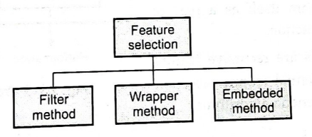
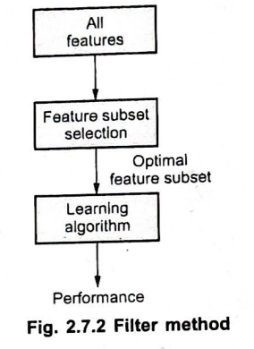
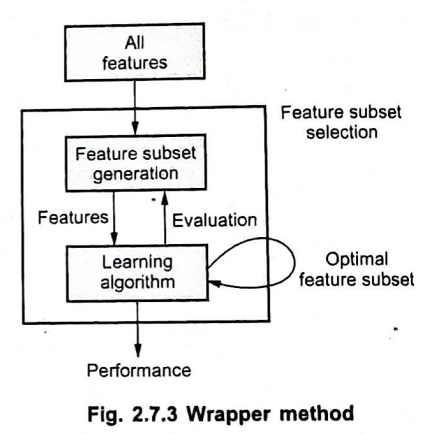
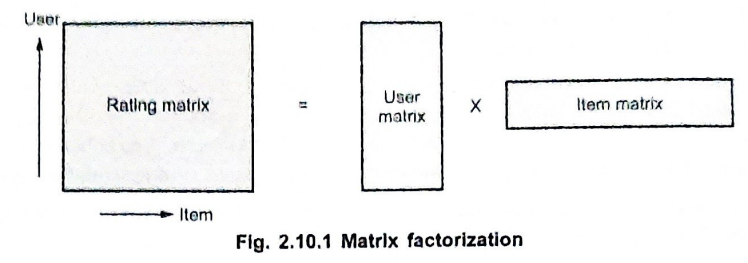

# Feature Engineering

### Q1. What is feature selection? Explain filtering technique.

**Feature Selection**

- In machine learning, feature selection is the process of identifying and selecting the most relevant features (or attributes) from a dataset to improve model performance and reduce computational complexity.
- By focusing on the most informative features, we can:

- **Improve model accuracy:** Irrelevant features can introduce noise and bias, hindering the model's ability to learn meaningful patterns.
- **Reduce overfitting:** Fewer features can help prevent the model from memorizing the training data too closely, leading to poor generalization.
- **Enhance interpretability:** A smaller set of features can make the model's decision-making process easier to understand.
- To speed up learning algorithm and reduce computational costs.
- There are three main approaches to feature selection:  Filter Methods, Wrapper Methods, and Embedded Methods.

### Filtering Technique

- The filtering technique is one of the simplest and most commonly used methods for feature selection.
- It works independently of the machine learning model and relies solely on the statistical properties of the features.
- The basic idea is to evaluate each feature individually and score it according to a certain criterion.
- Features are then ranked based on their scores, and the top-ranking features are selected for the model.
- The filtering technique is usually used with supervised learning algorithms, such as linear regression, logistic regression, and decision trees.

**Diagram:**
- All features  -> Feature subset selection -> Learning algorithm -> Performance

Some common filtering methods include:

1. **Correlation Coefficient**: 
   - Features with a high correlation with the target variable are selected.
   - Example: Pearson correlation for continuous variables.

2. **Chi-Square Test**:
   - This test is used for categorical features to measure the association between the feature and the target variable.
   - A higher Chi-square score indicates a stronger correlation with the target.

3. **Mutual Information**:
   - This method measures the mutual dependence between the feature and the target variable.
   - It works for both categorical and continuous variables.

4. **Variance Threshold**:
   - Features with very low variance (i.e., features that do not change much across data points) are considered uninformative and are removed.

### Advantages of Filtering Techniques
- **Simplicity**: Easy to understand and implement.
- **Speed**: Since it doesn't involve model training, it's computationally efficient.
- **Model Independence**: Filtering techniques work independently of the machine learning model, making them versatile.

### Disadvantages of Filtering Techniques
- **Ignorance of Feature Interaction**: Filtering techniques evaluate each feature independently, which might overlook the interactions between features.
- **Potential for Poor Performance**: Since filtering techniques don't involve model training, the selected features might not always yield the best performance for the specific model being used.

Overall, filtering techniques are often used as a first step in the feature selection process, especially when dealing with a large number of features.

---

### Q2. How to handle missing values in a dataset that will be used for training the ML model?


### Handling Missing Values in a Dataset for Machine Learning

**Introduction:**
- Handling missing data is a critical step in preparing a dataset for machine learning, as missing values can lead to biased estimates, inaccurate predictions, and errors in model training.
- Depending on the nature and amount of missing data, different strategies can be employed to manage these gaps effectively.

### 1. **Understanding the Nature of Missing Data:**

Before addressing missing values, it’s essential to understand why data is missing. Missing data can be classified into three types:

- **Missing Completely at Random (MCAR):** The absence of data is independent of any other data. For example, a random error in data entry.
- **Missing at Random (MAR):** The missingness is related to other observed data but not the missing data itself. For example, income data missing more frequently for younger individuals.
- **Missing Not at Random (MNAR):** The missing data is related to the missing values themselves. For instance, people with lower incomes might be less likely to report their income.

### 2. **Identifying Missing Data:**

To effectively handle missing data, first, identify the missing values:
- **Using Pandas in Python:** Methods like `isnull()` or `isna()` can be used to detect missing values in a dataset.
- **Visualization Tools:** Libraries such as `missingno` can visually represent the distribution and pattern of missing data.

### 3. **Techniques to Handle Missing Data:**

Once identified, several strategies can be used to handle missing values, depending on the context:

#### a. **Deletion Methods:**

- **Listwise Deletion (Removing Rows):** 
  - This involves removing rows with missing values.
  - **Advantages:** Simple and quick. Useful when the missing data is minimal.
  - **Drawbacks:** Leads to data loss, which may affect the model's accuracy if significant data is removed.

- **Removing Columns:** 
  - Entire columns are dropped if a large portion of their data is missing.
  - **Advantages:** Appropriate when the column is not critical for the analysis.
  - **Drawbacks:** Potential loss of important information.

#### b. **Imputation Methods:**

- **Mean/Median/Mode Imputation:** 
  - Replace missing numerical data with the mean or median and categorical data with the mode.
  - **Advantages:** Simple and fast. Effective when the percentage of missing data is small.
  - **Drawbacks:** Can distort the distribution and reduce variability, leading to biased models.

- **K-Nearest Neighbors (KNN) Imputation:**
  - Impute missing values using the values of k-nearest neighbors.
  - **Advantages:** Considers the relationships between variables.
  - **Drawbacks:** Computationally expensive, especially for large datasets.

#### c. **Advanced Techniques:**

- **Using Algorithms that Handle Missing Data:**
  - Some machine learning algorithms, like Decision Trees and XGBoost, can handle missing data internally by treating them as a separate category or using surrogate splits.
  - **Advantages:** No need for explicit imputation.
  - **Drawbacks:** The performance depends on the algorithm's ability to handle missing data.

#### D. **Manual Techniques:**

- **Manually putting the values at Missing Data:**
  - This involves manually imputing missing values based on domain knowledge or expert judgment.
  - **Advantages:** Can be highly accurate if the imputation is done correctly.
  - **Drawbacks:** Time-consuming and not scalable for large datasets.


### 4. **Evaluating the Impact of Missing Data Handling:**

After applying a method, it is crucial to evaluate its impact:
- **Check Data Distribution:** Ensure that imputed values do not skew the original data distribution.
- **Cross-Validation:** Validate the model performance after imputation to ensure that the chosen method does not adversely affect the model.

### Conclusion:

Handling missing values is an essential step in data preprocessing for machine learning. The choice of method depends on the nature, extent, and distribution of missing data, as well as the specific requirements of the machine learning model. Properly addressing missing data ensures that the model is trained on clean, accurate, and representative data, leading to better performance and more reliable predictions.

---
### Q3. Explain min-max scaling with suitable example

- **Min-Max Scaling**, also known as **Normalization**, is a technique used in data preprocessing to rescale the features of a dataset to a fixed range, typically between 0 and 1. 
- This is especially useful when different features have different units or scales, as it ensures that all features contribute equally to the model.
- Min-Max Scaling is a linear transformation, which means that the values of the transformed features are distributed between 0 and 1.


### How Min-Max Scaling Works

The formula for Min-Max Scaling is:


X' = (X - Xmin )/ (Xmax - Xmin)


- **(X)**: The original value of the feature.
- **(X_{{min}})**: The minimum value of the feature in the dataset.
- **(X_{{max}})**: The maximum value of the feature in the dataset.
- **(X')**: The normalized value after scaling.

This transformation scales the values of (X) to a new range of 0 to 1, where:
- 0 corresponds to the minimum value in the original data.
- 1 corresponds to the maximum value in the original data.

### Example of Min-Max Scaling

Let's consider a simple example with a small dataset containing the heights of five individuals in centimeters:

| **Person** | **Height (cm)** |
|------------|-----------------|
| A          | 150             |
| B          | 160             |
| C          | 170             |
| D          | 180             |
| E          | 190             |

1. **Identify the Min and Max Values:**
   - **\(X_{\text{min}} = 150\)** (minimum height)
   - **\(X_{\text{max}} = 190\)** (maximum height)

2. **Apply the Min-Max Scaling Formula:**

For each height, apply the formula:

- For **Person A** (Height = 150):
  \[
  X' = \frac{150 - 150}{190 - 150} = \frac{0}{40} = 0
  \]
- For **Person B** (Height = 160):
  \[
  X' = \frac{160 - 150}{190 - 150} = \frac{10}{40} = 0.25
  \]
- For **Person C** (Height = 170):
  \[
  X' = \frac{170 - 150}{190 - 150} = \frac{20}{40} = 0.5
  \]
- For **Person D** (Height = 180):
  \[
  X' = \frac{180 - 150}{190 - 150} = \frac{30}{40} = 0.75
  \]
- For **Person E** (Height = 190):
  \[
  X' = \frac{190 - 150}{190 - 150} = \frac{40}{40} = 1
  \]

3. **Resulting Scaled Values:**

| **Person** | **Height (cm)** | **Normalized Height** |
|------------|-----------------|-----------------------|
| A          | 150             | 0.0                   |
| B          | 160             | 0.25                  |
| C          | 170             | 0.5                   |
| D          | 180             | 0.75                  |
| E          | 190             | 1.0                   |

### Benefits of Min-Max Scaling

- **Equal Contribution**: Ensures that all features contribute equally to the model, especially important for algorithms like K-Nearest Neighbors (KNN) or Neural Networks that are sensitive to the scale of input data.
- **Preserves Relationships**: Min-Max scaling preserves the relationships between data points by maintaining the original distribution and proportions, but on a new scale.

### Limitations of Min-Max Scaling

- **Sensitive to Outliers**: If the dataset contains outliers, they can significantly affect the \(X_{\text{min}}\) and \(X_{\text{max}}\) values, leading to a compressed range for the majority of the data.
- **Does Not Handle Outliers Well**: The presence of outliers can cause most of the data to be squished into a small range, reducing the effectiveness of the scaling.

### Conclusion

Min-Max Scaling is a straightforward and effective method for normalizing data, especially when features have different units or ranges. By rescaling the data to a fixed range, typically [0, 1], it ensures that all features contribute equally to the machine learning model, improving its performance. However, care must be taken in the presence of outliers, as they can distort the scaling process.

---

### Q4. Explain Dimensionality Reduction in ML  

## Dimensionality Reduction in Machine Learning

- **Dimensionality reduction** is a technique used to reduce the number of features (or dimensions) in a dataset while preserving the most relevant information.
- This can significantly improve model performance, reduce computational complexity, and enhance interpretability.

### Why Reduce Dimensionality?

* **Computational Efficiency:** Fewer features can lead to faster training and prediction times.
* **Improved Performance:** Removing irrelevant features can reduce noise and improve model accuracy.
* **Enhanced Interpretability:** A smaller feature set can make it easier to understand the model's decision-making process.
* **Visualization:** Reducing dimensions can make it possible to visualize high-dimensional data.

### Applications of Dimensionality Reduction

- **Data Preprocessing**: Preparing data for machine learning models, especially when the dataset has a large number of features.
- **Data Visualization**: Projecting high-dimensional data into 2D or 3D for better understanding and insights.
- **Noise Reduction**: Removing irrelevant or redundant features to create a cleaner dataset.
- **Speeding Up Algorithms**: Reducing the dimensionality helps in decreasing the computational complexity of algorithms, making them faster and more efficient.

### Common Techniques

1. **Principal Component Analysis (PCA):**
   * Finds a new set of uncorrelated features (principal components) that capture the most variance in the data.
   * The number of principal components can be chosen to retain a desired amount of variance.

2. **Linear Discriminant Analysis (LDA):**
   * Similar to PCA but specifically designed for classification problems.
   * Finds a projection that maximizes the separation between classes.

By carefully selecting a dimensionality reduction technique, you can improve the efficiency, accuracy, and interpretability of your machine learning models.

---

### Q5. Explain the process of Principal Component Analysis (PCA) in brief.

- **Principal Component Analysis (PCA)** is a statistical technique used to reduce the dimensionality of a dataset while preserving the most important information.
- It does this by finding a new set of uncorrelated features (principal components) that capture the maximum variance in the data.
- It transforms a high-dimensional dataset into a lower-dimensional space while retaining as much of the original data's variance as possible.

**Here's a brief overview of the PCA process:**

1. **Standardize the data:** Ensure that all features have a mean of 0 and a standard deviation of 1 to prevent features with larger scales from dominating the analysis.
2. **Calculate the covariance matrix:** Compute the covariance matrix between all pairs of features. This matrix measures the relationships between the features.
3. **Find the eigenvectors and eigenvalues:** Decompose the covariance matrix into its eigenvectors and eigenvalues. The eigenvectors represent the principal components, and the eigenvalues indicate the importance of each component.
4. **Sort the eigenvectors by decreasing eigenvalues:** Sort the eigenvectors from highest to lowest eigenvalues.
5. **Choose the principal components:** Select the principal components with the highest eigenvalues, as these capture the most variance in the data. The number of components chosen depends on the desired level of dimensionality reduction.
6. **Project the data onto the principal components:** Transform the original data onto the selected principal components to create a new, lower-dimensional representation.

**Advantages of PCA:**
- **Easy to Implement:** PCA is a simple and easy-to-implement machine learning algorithm.
- **Fast:** PCA is fast because it finds the principal components using an eigendecomposition of the covariance matrix, which is a linear operation.
- **Consistent:** PCA results are the same whether the original data is scaled or not.
- **Independent:** PCA is independent of the scale of the original data.
- **Explanatory:** PCA results can be interpreted in terms of the original features.

By understanding PCA, you can effectively reduce the dimensionality of your data and improve the efficiency and interpretability of your machine learning models.

### Q6. Explain the process of  Kernel Principal Component Analysis (PCA) in brief.

- **Kernel PCA** is a machine learning algorithm that uses a nonlinear mapping function to transform the data to a higher dimensional space.
- It is commonly used to find a non-linear projection that keeps the classes as far apart as possible in the transformed feature space.
- It is often used as a pre-processing step for other algorithms.
- Kernel Principal Component Analysis (Kernel PCA) is an extension of the traditional Principal Component Analysis (PCA) that enables it to handle non-linear data.
- While PCA is effective for linear dimensionality reduction, Kernel PCA allows for capturing more complex structures in data by using a non-linear mapping.

**Here's a brief overview of the KPCA process:**

1. **Choose a kernel function:** Select a kernel function that maps the original data into a higher-dimensional feature space. Common choices include the linear kernel, polynomial kernel, radial basis function (RBF) kernel, and sigmoid kernel.
2. **Compute the kernel matrix:** Calculate the kernel matrix, which measures the similarity between pairs of data points in the higher-dimensional feature space.
3. **Perform PCA on the kernel matrix:** Apply standard PCA to the kernel matrix to find the principal components.
4. **Project the data onto the principal components:** Transform the original data onto the selected principal components to create the reduced-dimensional representation.

**Advantages of KPCA:**
- **Nonlinear dimensionality reduction:** KPCA is a non-linear technique, making it suitable for data with complex relationships between features.
- **Feature extraction:** KPCA can be used for feature extraction and noise reduction.
- **Data visualization:** KPCA can be used to visualize high-dimensional data.
- **Fewer features:** KPCA can reduce the number of features in the dataset by selecting the most informative features.


By understanding KPCA, you can effectively extract non-linear features from your data and improve the performance of your machine learning models.

---

### Q7. Explain local binary pattern(LBP) feature extraction technique with suitable example

## Local Binary Patterns (LBP) Feature Extraction

- **Local Binary Patterns (LBP)** is a simple yet effective feature extraction technique used primarily in image processing and computer vision.
- It captures the local texture information in an image by comparing the intensity of each pixel to its neighbors.
-  It transforms an image into a binary pattern that encodes the local structure around each pixel, making it highly effective for recognizing textures and patterns in images.

The basic idea of LBP is to compare each pixel with its surrounding neighbors. The process involves the following steps:

**Process:**

1. **Define a neighborhood:** Choose a neighborhood size (e.g., 3x3) around each pixel.
2. **Thresholding:**The center pixel is compared to each of the 8 neighbors. Compare the intensity of the center pixel with the intensity of each neighbor.
    - If the neighbor's intensity is greater than or equal to the center pixel, then 1 is assigned to that pixel. 
    - If the neighbor's intensity is less than the center pixel, then 0 is assigned to that pixel.
3. **Binary code:** Create a binary code by concatenating the 0s and 1s from the neighborhood.
    - The LBP code is produced by concatenating the binary codes for each of the 8 neighbors in clockwise order.
4. **Calculate LBP value:** Convert the 8-bit binary number into a decimal value. This decimal value is the LBP code for the center pixel.

#### Example

Consider a 3x3 pixel grid from an image, where the center pixel has an intensity value of 50, and its surrounding pixel intensities are as follows:

```
  60  45  70
  30  50  90
  80  35  55
```

**Step 1: Thresholding the Neighborhood**

- Compare the center pixel (50) with its neighbors:
  - Top-left (60): 60 ≥ 50 → 1
  - Top-middle (45): 45 < 50 → 0
  - Top-right (70): 70 ≥ 50 → 1
  - Left (30): 30 < 50 → 0
  - Right (90): 90 ≥ 50 → 1
  - Bottom-left (80): 80 ≥ 50 → 1
  - Bottom-middle (35): 35 < 50 → 0
  - Bottom-right (55): 55 ≥ 50 → 1

This gives the binary pattern: `10101101`.

**Step 2: Binary Pattern Formation**

- Arrange the binary values in a clockwise order starting from the top-left pixel:
  - `10101101`

**Step 3: LBP Code Calculation**

- Convert this binary number to a decimal value:
  - `10101101` in binary = 173 in decimal.

Thus, the LBP code for the center pixel is **173**.

**Step 4: Histogram Construction**

- Repeat the process for all pixels in the image to calculate their LBP codes.
- Construct a histogram of these LBP codes. For example, if your image has a lot of similar patterns, certain LBP codes will appear more frequently, and their frequency will be higher in the histogram.

The histogram of LBP codes across the image serves as the feature vector that describes the texture of the image.

**Applications:**

* **Texture classification:** LBP features are excellent for capturing texture information in images, making them suitable for tasks like texture classification and segmentation.
* **Face recognition:** LBP features are often used to represent facial images, as they are invariant to rotation and illumination changes.
* **Object detection:** LBP features can be used to detect objects in images based on their texture patterns.

### Advantages of LBP

- **Simplicity**: LBP is computationally simple and easy to implement.
- **Robustness**: It is robust to monotonic changes in illumination, making it effective in varying lighting conditions.
- **Efficiency**: LBP can be computed quickly, making it suitable for real-time applications.

LBP is a powerful and widely used feature extraction technique that offers a simple yet effective way to capture local texture information in images. It has proven to be effective in a variety of computer vision applications.

---

### Q8. Calculate LBP code generated value for the central point in the neighborhood of 8 pixels as shown

```
10  12  18
 7   9   6
 9   2   4
```


To calculate the Local Binary Pattern (LBP) code for the central pixel in the given 3x3 neighborhood, follow these steps:

### Given 3x3 Neighborhood:

```
10  12  18
 7   9   6
 9   2   4
```

The central pixel value is **9**.

### Step 1: Threshold the Neighborhood

Compare each neighboring pixel's value with the central pixel value (9):

- Top-left (10): 
10
≥
9
10≥9 → 1
- Top-middle (12): 
12
≥
9
12≥9 → 1
- Top-right (18): 
18
≥
9
18≥9 → 1
- Left (7): 
7
<
9
7<9 → 0
- Right (6): 
6
<
9
6<9 → 0
- Bottom-left (9): 
9
≥
9
9≥9 → 1
- Bottom-middle (2): 
2
<
9
2<9 → 0
- Bottom-right (4): 
4
<
9
4<9 → 0

This gives the binary pattern: **11100100**.

### Step 2: Binary Pattern Formation

Arrange the binary values in a clockwise order starting from the top-left pixel:

- Binary Pattern: **11100100**

### Step 3: LBP Code Calculation

Convert the binary number to a decimal value:

- **11100100** in binary = **228** in decimal.

### Conclusion

The LBP code for the central pixel in the given 3x3 neighborhood is **228**.

---

### Q9. Explain various Feature Selection Techniques

- Feature selection is a crucial step in the machine learning pipeline, especially when working with high-dimensional datasets.
- It involves selecting a subset of relevant features (input variables) for building a model. 
- The primary goal is to improve the model's performance by reducing overfitting, improving accuracy, and decreasing computational cost.

- There are several feature selection techniques, which can be broadly categorized into three types: Filter Methods, Wrapper Methods, and Embedded Methods.



### 1. Filter Methods

 
 **Refer Q1.**

### 2. Wrapper Methods  (Q Explain the types of Wrapper method for feature selection)

- Wrapper methods evaluate the performance of a subset of features by training and testing a model on it.
- They are more computationally expensive but can provide better results as they consider feature interactions.

#### Common Wrapper Methods:

- **Forward Selection**:
  - Starts with an empty model and adds features one by one.
  - At each step, the feature that improves the model's performance the most (e.g., accuracy, F1 score) is added.
  - The process continues until adding more features does not improve the model performance significantly.

- **Backward Elimination**:
  - Starts with all features in the model and removes them one by one.
  - At each step, the feature whose removal causes the least decrease in model performance is eliminated.
  - The process continues until removing more features causes a significant drop in performance.

- **Recursive Feature Elimination (RFE)**:
  - RFE iteratively builds a model and eliminates the least important feature at each iteration.
  - The process is repeated until the desired number of features is reached.
  - Typically used with models that have coefficients representing feature importance, such as linear regression or support vector machines.



### 3. Embedded Methods

- Embedded methods perform feature selection during the process of model training.
- These methods are integrated into specific machine learning algorithms, making them more efficient than wrapper methods.
- Feature selection is built into the machine learning algorithm itself.
- Regularization: Techniques like L1 (Lasso) and L2 (Ridge) regularization penalize models with many features, encouraging sparsity.


### Comparison of Techniques

- **Filter Methods**:
  - Pros: Fast, simple, and independent of the model.
  - Cons: May ignore feature interactions and may not always improve model performance.

- **Wrapper Methods**:
  - Pros: Consider feature interactions and typically improve model performance.
  - Cons: Computationally expensive, especially with a large number of features.

- **Embedded Methods**:
  - Pros: Efficient as feature selection is integrated with model training; often results in better performance.
  - Cons: Limited to specific algorithms and may require careful tuning of regularization parameters.

### Conclusion

Feature selection is a key step in building efficient and effective machine learning models, especially when dealing with high-dimensional datasets. The choice of feature selection technique depends on the specific problem, dataset, and computational resources. By selecting the most relevant features, you can improve model performance, reduce overfitting, and make your models more interpretable and faster to train.

---

### Q10. What is Matrix Factorization? Explain content based filtering with an example

## Matrix Factorization

- **Matrix factorization** is a technique used to decompose a matrix into the product of two or more smaller matrices.
- In the context of recommendation systems, it is used to predict user preferences for items based on their ratings or interactions with other items.

**Content-based Filtering**

- Content-based filtering is a recommendation system technique that suggests items to users based on their similarity to items the user has previously liked or interacted with.
- It relies on metadata about the items, such as genre, keywords, or descriptions, to determine their similarity.

**Example:**

Let's say we have a dataset of users and their ratings for movies. We can represent this data as a user-item matrix, where rows represent users and columns represent movies.

| User | Movie 1 | Movie 2 | Movie 3 |
|---|---|---|---|
| User 1 | 5 | 3 | 1 |
| User 2 | 4 | 2 | 5 |
| User 3 | 2 | 4 | 3 |

**Matrix Factorization:**

We can decompose this matrix into two smaller matrices: a user matrix and an item matrix.

* **User matrix:** Represents the latent factors or preferences of each user.
* **Item matrix:** Represents the latent features or characteristics of each item.

By multiplying these two matrices, we can approximate the original user-item matrix.

**Content-based Filtering:**

To recommend movies to a user using content-based filtering, we would:

1. **Extract item features:** Extract relevant features from each movie, such as genre, director, or actors.
2. **Calculate similarity:** Compute the similarity between the features of the movies the user has rated and the features of other movies.
3. **Recommend:** Recommend movies with the highest similarity scores to the user.

**For example:**

If User 1 has rated "Movie 1" highly, and "Movie 2" is similar to "Movie 1" based on genre and director, then content-based filtering would recommend "Movie 2" to User 1.

**Advantages of Content-based Filtering:**

* **Personalization:** Recommendations are tailored to the individual user's preferences.
* **No need for collaborative data:** Doesn't require ratings from other users.
* **Explainability:** Recommendations can be explained based on the similarities between items.

**Disadvantages of Content-based Filtering:**

* **Limited diversity:** May recommend similar items to what the user has already seen.
* **Cold-start problem:** Difficulty recommending items to new users or for items with limited metadata.




### Q11. Consider a vector x = (23, 29, 52, 31, 45, 19, 18, 27) Apply feature scaling and find out min-max scaled values as well as z-score values.

## Feature Scaling: Min-Max Scaling and Z-Score Scaling

**Given vector x = (23, 29, 52, 31, 45, 19, 18, 27)**

### Min-Max Scaling
* Scales values to a specific range (usually 0 to 1).
* Formula: `(x - min(x)) / (max(x) - min(x))`

**Calculations:**

* `min(x) = 18`
* `max(x) = 52`

**Scaled values:**

| Original Value | Min-Max Scaled |
|---|---|
| 23 | (23 - 18) / (52 - 18) = 0.125 |
| 29 | (29 - 18) / (52 - 18) = 0.281 |
| 52 | (52 - 18) / (52 - 18) = 1.0 |
| 31 | (31 - 18) / (52 - 18) = 0.344 |
| 45 | (45 - 18) / (52 - 18) = 0.719 |
| 19 | (19 - 18) / (52 - 18) = 0.029 |
| 18 | (18 - 18) / (52 - 18) = 0.0 |
| 27 | (27 - 18) / (52 - 18) = 0.25 |

### Z-Score Scaling (Standardization)
* Scales values to have a mean of 0 and standard deviation of 1.
* Formula: `(x - mean(x)) / std(x)`

**Calculations:**

* `mean(x) = 30.25`
* `std(x) = 10.64`

**Scaled values:**

| Original Value | Z-Score Scaled |
|---|---|
| 23 | (23 - 30.25) / 10.64 = -0.67 |
| 29 | (29 - 30.25) / 10.64 = -0.12 |
| 52 | (52 - 30.25) / 10.64 = 2.02 |
| 31 | (31 - 30.25) / 10.64 = 0.07 |
| 45 | (45 - 30.25) / 10.64 = 1.38 |
| 19 | (19 - 30.25) / 10.64 = -1.06 |
| 18 | (18 - 30.25) / 10.64 = -1.15 |
| 27 | (27 - 30.25) / 10.64 = -0.30 |

**Note:** The choice of scaling technique depends on the specific machine learning algorithm and the desired properties of the scaled data. Min-max scaling is useful when you want to preserve the relative relationships between values, while z-score scaling is useful when you want to standardize the data and assume a normal distribution.

### Q11. Calculate Z- score normalization. AGE = {18, 22, 25, 42, 28, 43, 33, 35, 56, 28}

## Calculating Z-Score Normalization

**Z-score normalization** is a statistical method used to transform data into a standard normal distribution with a mean of 0 and a standard deviation of 1. This is useful in machine learning and data analysis to ensure that features are on a comparable scale.

**Formula:**
```
Z-score = (x - mean) / standard deviation
```

**Given data:**
AGE = {18, 22, 25, 42, 28, 43, 33, 35, 56, 28}

**Steps:**

1. **Calculate the mean:**
   * Mean = (18 + 22 + 25 + 42 + 28 + 43 + 33 + 35 + 56 + 28) / 10 = 33

2. **Calculate the standard deviation:**
   * First, calculate the variance:
     * Variance = Σ(x - mean)² / n
   * Then, calculate the standard deviation:
     * Standard deviation = √variance

3. **Calculate the Z-score for each value:**
   * Use the formula above to calculate the Z-score for each age.

**Calculations:**

* Variance = [(18-33)² + (22-33)² + ... + (28-33)²] / 10 ≈ 122.4
* Standard deviation = √122.4 ≈ 11.06

**Z-scores:**

| Age | Z-score |
|---|---|
| 18 | (18 - 33) / 11.06 ≈ -1.38 |
| 22 | (22 - 33) / 11.06 ≈ -1.02 |
| 25 | (25 - 33) / 11.06 ≈ -0.74 |
| 42 | (42 - 33) / 11.06 ≈ 0.83 |
| 28 | (28 - 33) / 11.06 ≈ -0.46 |
| 43 | (43 - 33) / 11.06 ≈ 0.92 |
| 33 | (33 - 33) / 11.06 ≈ 0.00 |
| 35 | (35 - 33) / 11.06 ≈ 0.18 |
| 56 | (56 - 33) / 11.06 ≈ 2.12 |
| 28 | (28 - 33) / 11.06 ≈ -0.46 |

**Interpretation:**

* A Z-score of 0 indicates that the value is equal to the mean.
* A Z-score greater than 0 indicates the value is above the mean.
* A Z-score less than 0 indicates the value is below the mean.
* The magnitude of the Z-score indicates how many standard deviations away from the mean the value is.

----

