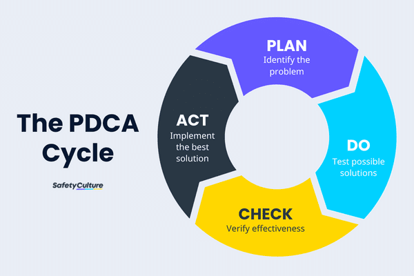

# Introduction to Software Testing

### Q1. Define software quality. List & explain core component of quality.

- **Software Quality** refers to the degree to which a software product meets specified requirements, customer expectations, and is free from defects.
- It encompasses both the functional aspects (what the software does) and non-functional aspects (how well the software performs its tasks).
- High-quality software is reliable, efficient, maintainable, and provides a good user experience.

### Core Components of Software Quality 

- Draw diagram of following components

### Core Components of Software Quality

1. **Functionality:** 
    - This refers to the software's ability to provide the correct functions that satisfy user needs.(write like this)
   * The software should perform its intended tasks correctly and accurately. 
   * It should adhere to the specified requirements and deliver the expected outcomes.

**Continuous Improvement**: Continuous improvement is a key aspect of software quality. It involves regularly evaluating the software's performance, identifying areas for improvement, and implementing changes to enhance its quality. This includes testing, feedback, and iterative development.

2. **Performance:** 
   * The software should operate efficiently, responding to user input promptly and consuming appropriate resources. 
   * It should be optimized for speed, memory usage, and resource utilization.
3. **Reliability:**
   * The software should be dependable and consistent in its operation. 
   * It should be free from frequent errors or crashes and should recover gracefully from unexpected situations.
4. **Usability:**
   * The software should be easy to use and understand by its target audience. 
   * It should have a clear and intuitive interface that minimizes user errors and confusion.
5. **Maintainability:** 
   * The software should be easy to modify, update, and enhance over time. 
   * It should have a well-structured codebase, clear documentation, and modular design.
6. **Portability:** 
   * The software should be adaptable to different hardware and software environments. 
   * It should be able to run on various platforms and configurations without significant modifications.
7. **Security:** 
   * The software should protect sensitive data and prevent unauthorized access. 
   * It should be resistant to security threats such as vulnerabilities, attacks, and data breaches.

These core components are interconnected and interdependent. Ensuring high quality in one area often influences the quality of others. For example, a well-designed and maintainable software product is more likely to be reliable and secure. 

---

### Q2. Define “Quality” as viewed by different stakeholders of software development and usage.

## Quality as Viewed by Different Stakeholders in Software Development and Usage

**Quality** in software development and usage is a multifaceted concept that varies depending on the perspective of different stakeholders involved in the process. Each group of stakeholders may prioritize different aspects of software quality based on their roles, responsibilities, and expectations.

### 1. **End Users:**
   * **View of Quality:** End users primarily focus on how well the software meets their needs and expectations. For them, quality is about ease of use, reliability, and performance.
   * **Key Aspects:** Usability, performance, reliability, user satisfaction, and seamless experience.

### 2. **Developers:**
   * **View of Quality:** Developers view quality as how well the code is written, how maintainable it is, and how easily it can be extended or debugged.
   * **Key Aspects:** Code readability, modularity, maintainability, and adherence to coding standards.

### 3. **Testers:**
   * **View of Quality:** Testers see quality in terms of how thoroughly the software has been tested, how many defects are found and fixed, and how well the software performs under various conditions.
   * **Key Aspects:** Defect density, test coverage, reliability, performance, and compliance with requirements.

### 4. **Project Managers:**
   * **View of Quality:** Project managers consider quality as the software's ability to meet the project goals, including staying within budget, timelines, and scope while meeting the client's requirements.
   * **Key Aspects:** Meeting deadlines, staying within budget, client satisfaction, and meeting requirements.

### 5. **Clients/Customers:**
   * **View of Quality:** Clients focus on whether the software meets the business objectives and adds value to their organization. They assess quality based on how well the software solves their problems and achieves their goals.
   * **Key Aspects:** Functionality, return on investment (ROI), reliability, and alignment with business objectives.

### 6. **Product Owners:**
   * **View of Quality:** Product owners view quality in terms of delivering a product that fulfills the market needs and meets the expectations of the target audience while staying competitive.
   * **Key Aspects:** Market fit, customer satisfaction, feature completeness, and innovation.

### 7. **Support and Maintenance Teams:**
   * **View of Quality:** These teams see quality as how easily they can support, maintain, and upgrade the software. They focus on the software's stability, documentation, and ease of troubleshooting.
   * **Key Aspects:** Stability, maintainability, clear documentation, and ease of support.

### 8. **Regulators and Compliance Auditors:**
   * **View of Quality:** For regulators, quality is about ensuring that the software adheres to legal and regulatory standards, particularly in industries with stringent compliance requirements.
   * **Key Aspects:** Compliance with standards, security, safety, and legal requirements.

### 9. **Business Analysts:**
   * **View of Quality:** Business analysts focus on how well the software aligns with the business requirements and user needs that were gathered during the analysis phase.
   * **Key Aspects:** Requirement fulfillment, traceability, and user satisfaction.

Each of these stakeholders views quality through a different lens, and effective software development must balance these varying perspectives to achieve a product that satisfies all parties involved.

---

### Q3. Why Software has Errors?

Software can have errors for several reasons, often stemming from the complexity of software development, human factors, and the nature of the software itself. Below are some of the common reasons why software has errors:

### 1. **Human Error**
   - **Reason**: Software is created by humans, and humans are prone to making mistakes. This can happen at any stage of development, from requirements gathering to coding, testing, and deployment.
   - **Examples**: Typographical errors in code, misunderstanding requirements, or logical errors in algorithms.

### 2. **Complexity of Software**
   - **Reason**: Modern software systems are incredibly complex, often consisting of millions of lines of code, multiple modules, and intricate interactions between components. This complexity increases the likelihood of errors.
   - **Examples**: Bugs arising from interactions between different modules, difficulty in predicting how changes in one part of the system will affect the rest.

### 3. **Changing Requirements**
   - **Reason**: Software requirements often change during the development process due to evolving business needs, market conditions, or user feedback. These changes can introduce new errors or inconsistencies.
   - **Examples**: Features added late in the development cycle, unclear or poorly communicated changes leading to incorrect implementations.

### 4. **Incomplete or Ambiguous Requirements**
   - **Reason**: If requirements are not clearly defined or are incomplete, developers might misinterpret what is needed, leading to errors in the software.
   - **Examples**: Missing edge cases in requirements, unclear descriptions of desired behavior, or conflicting requirements.

### 5. **Inadequate Testing**
   - **Reason**: If software is not thoroughly tested, errors may go unnoticed and make their way into production. This can happen due to time constraints, insufficient test coverage, or a lack of understanding of potential edge cases.
   - **Examples**: Bugs in rarely used features, issues that only arise under specific conditions, or performance problems that were not anticipated.

### 6. **Integration Issues**
   - **Reason**: Software often needs to integrate with other systems, third-party libraries, or hardware. Differences in interfaces, data formats, or communication protocols can lead to errors.
   - **Examples**: Incompatibility between different software versions, issues in API integration, or hardware-software mismatches.

### 7. **Concurrency and Timing Issues**
   - **Reason**: Software that involves parallel processing or multithreading can have timing-related issues, such as race conditions, deadlocks, or synchronization problems, which are difficult to detect and debug.
   - **Examples**: Two threads trying to access the same resource simultaneously, causing inconsistent behavior, or a system crash due to deadlock.

### 8. **Environmental Factors**
   - **Reason**: The environment in which software runs can influence its behavior. Differences in hardware, operating systems, network conditions, or configurations can lead to errors that weren't present in the development environment.
   - **Examples**: Software that works on one operating system but fails on another, or network-dependent applications that behave differently under varying network conditions.

### 9. **Software Reuse**
   - **Reason**: Reusing code or components from other projects can introduce errors if those components have not been adequately tested in the new context or if they were designed for a different environment.
   - **Examples**: Bugs inherited from third-party libraries, assumptions in reused code that do not hold in the new application.

### 10. **Lack of Experience or Expertise**
   - **Reason**: Developers may lack the necessary experience or expertise in certain areas of the software they are developing, leading to mistakes.
   - **Examples**: Misuse of complex algorithms, improper implementation of security measures, or inefficient code that leads to performance problems.

### 11. **Insufficient Communication**
   - **Reason**: Poor communication between team members or between stakeholders and developers can lead to misunderstandings, missed requirements, and inconsistent implementations.
   - **Examples**: Misinterpretation of user needs, lack of clarity in technical specifications, or conflicting assumptions about system behavior.

These factors highlight the inherent challenges in software development and why achieving error-free software is difficult, if not impossible. Continuous testing, thorough requirements analysis, effective communication, and adopting best practices in software engineering can help minimize errors.

---

### Q4. What is bug, defect, error  and failure. Give Examples of each. Also Explain What is bug tracking, bug fixing and bug verification.

### Definitions and Examples

#### 1. **Bug**
   - **Definition:** A bug is a flaw or issue in the software code that causes the software to behave unexpectedly or incorrectly. Bugs are typically identified during testing or when users encounter problems during the use of the software.
   - **Example:** A calculator app showing an incorrect result for a specific arithmetic operation, like 2 + 2 = 5, due to a coding mistake.

#### 2. **Defect**
   - **Definition:** A defect is a deviation from the expected behavior of the software product as specified in the requirements. It is an imperfection in the product that might or might not manifest as a bug during execution.
   - **Example:** A defect could be a feature in a mobile app that doesn't work as intended, like a "Save" button that doesn't save data properly, even though the button is visible and clickable.

#### 3. **Error**
   - **Definition:** An error is a human mistake that leads to incorrect outcomes in software development. It can occur during any phase of the software development life cycle (SDLC) such as in design, coding, or requirement analysis.
   - **Example:** A developer misinterprets a requirement, leading to incorrect logic being implemented in the code. For instance, writing an "if" statement incorrectly so that it never evaluates as true.

#### 4. **Failure**
   - **Definition:** A failure occurs when the software does not perform a required function according to its specifications. It is the manifestation of a bug or defect during operation.
   - **Example:** A mobile app crashes every time a user tries to upload a photo. This crash is a failure, resulting from an unhandled exception in the code.

### Processes Involved

#### 1. **Bug Tracking**
   - **Definition:** Bug tracking is the process of identifying, recording, managing, and monitoring bugs in the software. This is usually done using bug tracking tools like JIRA, Bugzilla, or GitHub Issues, where each bug is documented with details such as steps to reproduce, severity, and status.
   - **Example:** A tester identifies a bug in an application, logs it in a bug tracking tool with a description, steps to reproduce, expected vs. actual results, and assigns it to a developer for fixing.

#### 2. **Bug Fixing**
   - **Definition:** Bug fixing involves diagnosing and resolving the bug in the software code. The developer analyzes the bug, finds the cause, and modifies the code to correct the issue, ensuring that the software behaves as expected.
   - **Example:** After identifying that a loop in the code is causing an application to freeze, the developer rewrites the loop to eliminate the infinite loop condition, thereby fixing the bug.

#### 3. **Bug Verification**
   - **Definition:** Bug verification is the process of confirming that the bug has been successfully fixed and that the fix did not introduce any new issues. This usually involves retesting the scenario where the bug was initially found, as well as performing regression testing to ensure overall stability.
   - **Example:** After a bug is fixed, the QA team retests the specific feature where the bug was found to ensure it works correctly. They might also check other related features to verify that the fix did not introduce new problems.

### Summary

- **Bug:** A coding error causing unexpected behavior (e.g., miscalculation in a calculator app).
- **Defect:** A deviation from specifications that may not always cause bugs (e.g., a non-functional "Save" button).
- **Error:** A mistake made during development (e.g., misinterpreting requirements).
- **Failure:** The software's inability to perform a required function (e.g., app crashing on photo upload).
  
**Bug Tracking** involves documenting and managing bugs, **Bug Fixing** is the process of resolving those bugs, and **Bug Verification** ensures that the bugs are properly fixed and no new issues have been introduced.

---

### Q5. Explain Total Quality Management.(TQM) and Quality practices of TQM

- Total Quality Management (TQM) is a comprehensive approach to long-term success through customer satisfaction.
- It is a management philosophy that seeks to improve the quality of products and services by focusing on continuous improvement, involving all members of an organization.
- TQM integrates all organizational functions (such as marketing, finance, design, engineering, production, customer service) to focus on meeting customer needs and organizational objectives.

## Total Quality Management (TQM)

**Total Quality Management (TQM)** is a philosophy and approach to management that aims to achieve and maintain high levels of quality in all aspects of an organization's products, services, and processes. It involves a continuous improvement mindset, customer focus, employee involvement, and data-driven decision-making.

### Core Principles of TQM

1. **Customer Focus:** TQM emphasizes understanding and meeting customer needs and expectations. This involves gathering feedback, analyzing customer requirements, and continuously improving products and services to exceed customer satisfaction.
2. **Continuous Improvement:** TQM promotes a culture of constant improvement through incremental changes and innovation. This involves identifying areas for improvement, implementing corrective actions, and monitoring results.
3. **Employee Involvement:** TQM recognizes that employees are a valuable asset and their involvement is crucial for success. It encourages employees to participate in decision-making, problem-solving, and quality improvement initiatives.
4. **Data-Driven Decision Making:** TQM emphasizes the use of data and metrics to make informed decisions and track progress. This involves collecting and analyzing data to identify trends, measure performance, and evaluate the effectiveness of quality initiatives.
5. **Process Improvement:** TQM focuses on improving processes to eliminate waste, reduce defects, and increase efficiency. This involves identifying and analyzing processes, identifying areas for improvement, and implementing changes to optimize performance.
6. **Supplier Partnership:** TQM recognizes the importance of suppliers in achieving high quality. It encourages collaboration with suppliers to ensure they meet quality standards and work together to improve processes.

### Quality Practices of TQM

1. **Quality Planning:** This involves defining quality goals, establishing quality standards, and developing plans to achieve them.
2. **Quality Assurance:** This involves implementing quality control measures to ensure that products and services meet established standards.
3. **Quality Control:** This involves inspecting products and services to identify and correct defects.
4. **Quality Improvement:** This involves identifying areas for improvement and implementing changes to enhance quality.
5. **Quality Auditing:** This involves conducting regular audits to assess compliance with quality standards and identify areas for improvement.

TQM is a comprehensive approach that requires a commitment from all levels of the organization. By implementing TQM principles and practices, organizations can improve their competitiveness, customer satisfaction, and overall performance.

---

### Q6. Describe “Total Quality Management” Principles of continual improvement.

### Total Quality Management (TQM) Principles of Continual Improvement

**Continual improvement** is a core principle of Total Quality Management (TQM). It emphasizes the ongoing effort to enhance products, services, processes, and overall organizational performance. This principle is based on the belief that there is always room for improvement, and it drives organizations to consistently seek ways to better meet customer needs and achieve higher levels of quality.

### Key Aspects of Continual Improvement in TQM

1. **Plan-Do-Check-Act (PDCA) Cycle:**
   - **Explanation:** The PDCA cycle, also known as the Deming Cycle, is a systematic process for achieving continuous improvement. It involves four stages:
     - **Plan:** Identify an area for improvement, analyze the current situation, and develop a plan to implement changes.
     - **Do:** Execute the plan on a small scale to test its effectiveness.
     - **Check:** Monitor and evaluate the results of the implementation to see if the desired improvement was achieved.
     - **Act:** If the test is successful, implement the change on a larger scale. If not, refine the plan and repeat the cycle.
   - **Practice:** Organizations use the PDCA cycle to address specific issues, improve processes, and ensure that changes lead to sustainable improvements.

2. **Benchmarking:**
   - **Explanation:** Benchmarking involves comparing an organization's processes, products, or services with those of leading competitors or industry best practices. It helps identify areas where the organization can improve by adopting successful strategies from others.
   - **Practice:** Organizations regularly conduct benchmarking studies to assess their performance relative to others and set targets for improvement based on these comparisons.

3. **Employee Involvement:**
   - **Explanation:** Continual improvement relies heavily on the active participation of employees. By involving employees in the improvement process, organizations can tap into their knowledge, creativity, and experience to identify and solve problems.
   - **Practice:** Organizations may implement suggestion programs, quality circles, or team-based problem-solving sessions to engage employees in the continual improvement process.

4. **Customer Feedback and Focus:**
   - **Explanation:** Understanding customer needs and expectations is critical to continual improvement. Organizations must regularly gather and analyze customer feedback to identify areas for enhancement.
   - **Practice:** Continual improvement involves using customer surveys, feedback forms, and direct interactions to collect insights, which are then used to drive improvements in products, services, and processes.

5. **Data-Driven Decision Making:**
   - **Explanation:** Continual improvement is guided by data and factual information rather than intuition or guesswork. Organizations use data to identify trends, measure performance, and make informed decisions about where and how to improve.
   - **Practice:** Tools such as statistical process control (SPC), root cause analysis, and performance metrics are used to analyze data and guide the improvement process.

6. **Standardization of Best Practices:**
   - **Explanation:** Once improvements are made, it is essential to standardize the new processes or practices to ensure that the gains are maintained and replicated across the organization.
   - **Practice:** Organizations document and implement new standards, procedures, and guidelines to institutionalize the improvements, ensuring that they become part of the regular workflow.

7. **Innovation and Creativity:**
   - **Explanation:** Continual improvement encourages innovation and creative problem-solving to find new ways of enhancing quality. This involves thinking outside the box and challenging existing assumptions.
   - **Practice:** Organizations foster a culture of innovation by encouraging employees to experiment with new ideas, technologies, and methods, and by rewarding successful innovations.

8. **Leadership Commitment:**
   - **Explanation:** Leadership plays a crucial role in driving continual improvement. Leaders must be committed to quality and continuous improvement, providing the necessary resources, support, and motivation for the organization to pursue these goals.
   - **Practice:** Leaders demonstrate their commitment by setting clear quality objectives, leading by example, and creating an environment where continual improvement is a priority.

### Summary

The principle of continual improvement in TQM is about making ongoing efforts to improve all aspects of an organization, from processes and products to employee involvement and customer satisfaction. Through methods like the PDCA cycle, Kaizen, benchmarking, and data-driven decision making, organizations can achieve gradual but consistent improvements that lead to higher quality, efficiency, and customer satisfaction. Continual improvement is a never-ending journey that is central to the TQM philosophy, ensuring that organizations remain competitive and responsive to changing market conditions and customer needs.

### Q7. Explain PDCA cycle.

### PDCA Cycle (Plan-Do-Check-Act)

The **PDCA Cycle**, also known as the **Deming Cycle** or **Shewhart Cycle**, is a continuous improvement model used in Total Quality Management (TQM) and other management practices. It is a four-step iterative process that helps organizations systematically solve problems and improve processes. The cycle promotes continuous feedback and learning, enabling organizations to refine their operations and achieve better results over time.

### Steps of the PDCA Cycle

#### 1. **Plan**
   - **Objective:** Identify and define the problem or area for improvement.
   - **Activities:**
     - Analyze the current situation to understand the problem or process that needs improvement.
     - Gather data, identify root causes, and determine what changes or improvements could be made.
     - Set specific, measurable objectives for improvement.
     - Develop a detailed action plan, outlining the steps, resources, timeline, and responsibilities needed to implement the changes.
   - **Example:** A manufacturing company identifies that its production line has a high defect rate. The team analyzes the process, identifies potential causes, and plans to implement a new quality control check at a critical stage of production.

#### 2. **Do**
   - **Objective:** Implement the plan on a small scale to test its effectiveness.
   - **Activities:**
     - Execute the action plan in a controlled environment or on a small scale (e.g., in a pilot project or specific department).
     - Collect data during the implementation to monitor the process and results.
     - Document any issues, observations, and deviations from the plan.
   - **Example:** The company implements the new quality control check on one production line, monitoring the defect rate and gathering data to assess the impact of the change.

#### 3. **Check**
   - **Objective:** Evaluate the results of the implementation against the objectives set in the planning phase.
   - **Activities:**
     - Analyze the data collected during the "Do" phase to determine whether the changes led to the desired improvement.
     - Compare the actual results with the expected outcomes.
     - Identify any discrepancies or areas where the plan did not work as intended.
     - Assess whether the plan should be adopted, modified, or abandoned.
   - **Example:** The team reviews the defect rate data after implementing the new quality control check. They find that the defect rate has decreased significantly, confirming the effectiveness of the change.

#### 4. **Act**
   - **Objective:** Take action based on the results from the "Check" phase, either by standardizing the successful change or by revising the plan.
   - **Activities:**
     - If the plan was successful, implement the changes on a larger scale across the organization.
     - Standardize the new process by updating procedures, training staff, and integrating the changes into the regular workflow.
     - If the plan was not successful, refine the plan and go through the cycle again, or try an alternative approach.
     - Document lessons learned and best practices for future improvements.
   - **Example:** Since the new quality control check reduced the defect rate, the company rolls it out across all production lines. They update their standard operating procedures (SOPs) and provide training to ensure consistent implementation.

### Summary

The PDCA Cycle is a powerful tool for continuous improvement, enabling organizations to systematically address problems, implement changes, and refine their processes. By following the four steps—Plan, Do, Check, Act—organizations can ensure that improvements are carefully planned, tested, evaluated, and standardized. This iterative process fosters a culture of ongoing learning and adaptability, which is essential for maintaining high quality and achieving long-term success.

---

### Q8. Examine the relationship between Quality and Productivity.

### Relationship Between Quality and Productivity

**Quality** and **productivity** are closely related concepts in the context of business operations and manufacturing. Both are essential for achieving organizational success, but they often require a careful balance. Understanding their relationship can help organizations optimize processes, reduce costs, and enhance customer satisfaction.

### Definitions

- **Quality:** Refers to the degree to which a product or service meets customer expectations and conforms to specified standards. High-quality products are reliable, durable, and free from defects.
- **Productivity:** Refers to the efficiency with which inputs (like labor, materials, and time) are converted into outputs (products or services). Higher productivity means producing more with the same or fewer resources.

The relationship between quality and productivity in software testing and quality assurance is crucial to understand for delivering effective and efficient software solutions. Here are six key points:

1. **Quality Enhances Productivity**: High-quality software leads to fewer defects, which reduces the time spent on rework and fixes. This allows teams to focus on productive tasks, such as developing new features.

2. **Productivity Affects Quality**: Increased productivity can lead to a higher output of code and features. However, if productivity is pursued at the expense of quality (e.g., skipping testing phases), it can lead to an accumulation of defects, ultimately lowering the overall quality of the software.

3. **Balance is Key**: Striking a balance between quality and productivity is essential. High productivity with low quality can result in unstable software, whereas focusing solely on quality may slow down the development process.

4. **Automated Testing as a Bridge**: Implementing automated testing tools can simultaneously improve both quality and productivity. Automated tests help identify defects early and allow for continuous integration and deployment, speeding up the development process without compromising on quality.

5. **Cost Implications**: Poor quality often leads to higher costs due to defect correction and customer dissatisfaction, which can reduce overall productivity. Conversely, investing in quality assurance can reduce these long-term costs and improve productivity.

6. **Customer Satisfaction**: High-quality software leads to greater customer satisfaction, which can result in positive feedback and reduced customer support needs. This can free up resources and improve productivity by allowing the team to focus on new development rather than fixing issues.

---

### Q9.Give classification for different types of products.

Different types of products can be classified based on various criteria, including their nature, usage, and market characteristics. Here’s a classification based on some common criteria:

### 1. **Consumer Products**  
   These are products purchased by the end consumer for personal use.
   - **Convenience Products**: Frequently purchased, low-cost items that require minimal effort (e.g., toothpaste, snacks).
   - **Shopping Products**: Less frequently purchased, more expensive, and require more thought and comparison (e.g., electronics, clothing).
   - **Specialty Products**: Unique items with specific brand preferences, usually expensive and bought infrequently (e.g., luxury cars, designer clothes).
   - **Unsought Products**: Products that consumers do not usually think of buying, often purchased due to necessity rather than desire (e.g., insurance, emergency medical services).

### 2. **Industrial Products**  
   These are products used in the production of other goods or services.
   - **Raw Materials**: Basic materials used in manufacturing (e.g., wood, metals, chemicals).
   - **Component Parts**: Finished items used in the assembly of final products (e.g., engines, batteries).
   - **Capital Goods**: Large, long-lasting items used in production (e.g., machinery, buildings).
   - **Supplies and Services**: Short-term goods and services used in the production process (e.g., lubricants, office supplies, maintenance services).

### 3. **Digital Products**  
   These products are delivered electronically and used in digital form.
   - **Software**: Applications, operating systems, and other digital tools (e.g., Microsoft Office, antivirus programs).
   - **Digital Media**: E-books, music, videos, and other forms of digital content (e.g., streaming services, online publications).
   - **Online Services**: Subscriptions or services delivered over the internet (e.g., cloud storage, SaaS platforms).

### 4. **Durable and Non-Durable Goods**
   - **Durable Goods**: Products that have a long life and are used over time (e.g., appliances, furniture).
   - **Non-Durable Goods**: Consumable products that are used up quickly (e.g., food, beverages, paper products).

### 5. **Fast-Moving Consumer Goods (FMCG)**
   These are low-cost products that are sold quickly and in large quantities.
   - **Examples**: Packaged foods, toiletries, and over-the-counter drugs.

### 6. **Services**
   Although not physical products, services are a key part of the market.
   - **Personal Services**: Services provided to individuals (e.g., healthcare, education, entertainment).
   - **Business Services**: Services provided to organizations (e.g., consulting, legal services, financial services). 

This classification helps in understanding the diverse nature of products and how they are marketed, sold, and consumed.

### Q10. Plan Software Quality control with respect to space research.
Certainly! Here’s a one-sentence summary for each point:

1. **Define Requirements**: Ensure clear, detailed requirements with traceability across the development process.
2. **Standards Compliance**: Follow industry and space-specific standards for software development.
3. **Independent V&V**: Implement independent verification and validation to ensure reliability.
4. **Thorough Testing**: Conduct unit, integration, system, and end-to-end testing in simulated environments.
5. **Code Quality**: Perform regular code reviews, static analysis, and enforce security protocols.
6. **Continuous Monitoring**: Use telemetry and fault tolerance mechanisms for real-time monitoring and recovery.
7. **Comprehensive Documentation**: Maintain detailed documentation and provide training for mission operators.
8. **Risk Management**: Identify risks, perform failure mode analysis (FMEA), and develop mitigation strategies.

---

### Q11.Compare between tools and techniques.

Here’s a comparison between tools and techniques in software development, summarized in eight points:

1. **Definition**:
   - **Tools**: Software or applications used to perform specific tasks (e.g., IDEs, testing frameworks).
   - **Techniques**: Methods or processes applied to achieve a goal (e.g., Agile, TDD).

2. **Purpose**:
   - **Tools**: Facilitate the execution of tasks efficiently.
   - **Techniques**: Provide a structured approach to problem-solving.

3. **Dependence**:
   - **Tools**: Often rely on specific techniques to be effective.
   - **Techniques**: Can be implemented with or without specific tools.

4. **Tangibility**:
   - **Tools**: Physical or digital applications that are tangible.
   - **Techniques**: Conceptual approaches or methods.

5. **Adaptability**:
   - **Tools**: May require updates or replacements as technology evolves.
   - **Techniques**: Generally more stable and adaptable over time.

6. **Training**:
   - **Tools**: Require specific training to use effectively.
   - **Techniques**: Require understanding and practice to master.

7. **Scope**:
   - **Tools**: Typically address specific aspects of the development process.
   - **Techniques**: Provide a broader framework for overall processes.

8. **Interdependence**:
   - **Tools**: May need multiple tools for different tasks within the same technique.
   - **Techniques**: Can integrate multiple tools to enhance effectiveness.

   ---

   ### Q12. Explain defect life cycle

   The defect life cycle, also known as the bug life cycle, describes the stages a defect goes through from identification to resolution. Here’s a breakdown of each component:

1. **New**: A defect is identified and logged by a tester or developer, and its status is marked as "New."

2. **Assign**: The defect is reviewed by the project lead or manager, and then assigned to a developer or a team for resolution.

3. **Active**: The assigned developer starts working on the defect, analyzing and fixing the issue. The defect status changes to "Active."

4. **Test**: Once the defect is fixed, the developer submits it for testing. The tester then verifies whether the defect has been resolved in the new build.

5. **Verified**: If the tester confirms that the defect is fixed and the functionality works as expected, the status is updated to "Verified."

6. **Closed**: If the defect passes all necessary tests and does not recur, it is marked as "Closed," indicating that the issue is resolved.

7. **Reopened**: If the defect is still present after testing or recurs later, it is marked as "Reopened," and the cycle repeats from the "Assign" or "Active" stage.

8. **Rejected**: If the defect is found to be invalid, not reproducible, or not an actual issue, it is marked as "Rejected."

9. **Deferred**: If the defect is valid but not critical or can be fixed in a future release, its resolution is postponed, and it is marked as "Deferred."